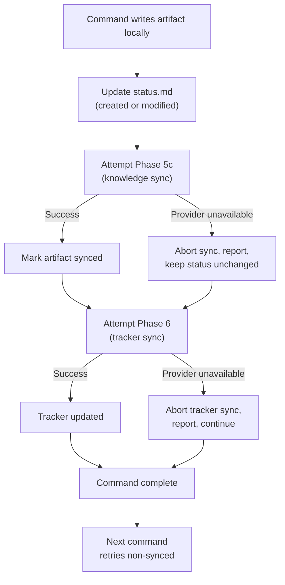

# Agentic-Driven Development — Reference

## Tasks Base Directory

The tasks base directory is the root location where task artifact directories are stored. It is **configurable** to support multiple AI coding tools:

- **Resolution order**: `stack-profile.md` → `binding.generation.tasks_dir` → default `~/.cursor/plans/`
- **Default**: `~/.cursor/plans/` (backward compatible with Cursor)
- **Configuration**: Declare `binding.generation.tasks_dir` in `stack-profile.md` (see `aias/contracts/readme-stack-profile.md` § Generation Bindings Contract)

All commands and skills that reference artifact directories must use the **resolved tasks directory** — never hardcode `~/.cursor/plans/`.

---

## Per-Mode Artifact Requirements

Each mode declares which artifacts it **requires** (must be present) and which are **optional** (loaded if present, not an error if absent).

| Mode | Required artifacts | Optional artifacts |
|------|--------------------|--------------------|
| `@planning` | — | `*.product.md`, `*.issue.md`, `*.fix.md`, `*.assessment.md` |
| `@product` | — | `*.product.md`, `*.design.md` |
| `@dev` | `*.plan.md`, `*.design.md` | `*.product.md`, `*.fix.md`, `*.assessment.md`, `*.trace.md` |
| `@qa` | `*.issue.md` | `*.trace.md`, `*.plan.md` |
| `@debug` | `*.fix.md`, `*.issue.md` | `*.plan.md` |
| `@review` | `*.plan.md` | `*.design.md`, `*.product.md` |
| `@delivery` | `*.charter.md` | `*.plan.md`, `*.product.md` |
| `@integration` | `*.plan.md` | — |
| `@devops` | — | `*.plan.md` |

If a mode is activated and TASK_DIR is set, run Phases 0–3 of the loading protocol automatically. If TASK_DIR is not set, proceed normally without artifact context.

---

## Loading Order

When multiple artifacts are loaded, follow this order to build context correctly:

1. `status.md` — always first (establishes profile, state, and progress)
2. `*.product.md` — business context and requirements
3. `*.plan.md` files — `technical.plan.md` → `increments.plan.md` → `dor.plan.md` → `dod.plan.md`
4. `*.design.md` — UI/design specifications
5. `*.issue.md` — issue reports
6. `*.fix.md` — root cause analysis
7. `*.assessment.md` — feasibility evaluation
8. `*.charter.md` — delivery charter
9. `*.trace.md` — instrumentation plan
10. `*.publish.md` — Plan Delta (read-only, for reference)

---

## Writing Rules

When a command writes an artifact:

1. **Create** the file if it does not exist; **overwrite** if it does. Artifacts are not append-only.
2. **Update `status.md`** immediately after writing:
   - Add the filename to the `artifacts` map with status `created` (new) or `modified` (overwrite).
   - Update `completed_steps` and `current_step` if the writing completes a workflow step.
3. **Never write artifacts outside TASK_DIR.** Every artifact goes to `<resolved_tasks_dir>/<TASK_ID>/`.
4. **Never invent artifact types.** Only the 12 types in the closed catalog + `status.md` are allowed.
5. **Content language:** English for all artifact content. Use the **technical-writing** skill patterns.

---

## Workflow Profiles

Each task follows one of five profiles. The profile determines which steps are expected, which artifacts are produced, and which mode/chat to use at each step. Chat names identify the conversation — if the same chat name appears in multiple steps, those steps happen in the same chat session (one mode per chat, never mix modes).

### `feature` — New feature implementation

| Step | Chat | Mode | Command | Artifacts produced | Tracker transition (canonical) |
|------|------|------|---------|--------------------|-----------------|
| product-analysis | Chat Product | `@product` | `/enrich` | `analysis.product.md` | — |
| blueprint | Chat Planning | `@planning` | `/blueprint` | plan artifacts + `specs.design.md` | — |
| validate | Chat Planning | `@planning` | `/validate-plan` | — | `pending_dor` → `ready` |
| consolidate | Chat Planning | `@planning` | `/consolidate-plan` (if gaps) | plan artifacts (updated) | — |
| implement | Chat Dev | `@dev` | `/implement` | — (code changes) | `ready` → `in_progress` |
| commit | Chat Dev | `@dev` | `/commit` | — | — |
| pr | Chat Dev | `@dev` | `/pr` | — (PR created) | `in_progress` → `in_review` |
| closure | (any) | (any) | `/publish` or `/brief`/`/report` | per classification | — |

### `bugfix` — Bug investigation and fix

| Step | Chat | Mode | Command | Artifacts produced | Tracker transition (canonical) |
|------|------|------|---------|--------------------|-----------------|
| investigate | Chat QA | `@qa` | `/issue` | `report.issue.md` | — |
| trace* | Chat QA | `@qa` | `/trace` | `instrumentation.trace.md` | — |
| trace-impl* | Chat Dev | `@dev` | implement trace plan (free instruction) | — (code changes) | — |
| trace-collect* | (manual) | — | run app, collect logs | — | — |
| trace-update* | Chat QA | `@qa` | update issue with logs | `report.issue.md` (updated) | — |
| analyze | Chat Debug | `@debug` | `/fix` | `analysis.fix.md` | — |
| assess | Chat Dev | `@dev` | `/assessment` | `feasibility.assessment.md` | — |
| blueprint | Chat Planning | `@planning` | `/blueprint` | plan artifacts | — |
| validate | Chat Planning | `@planning` | `/validate-plan` | — | `pending_dor` → `ready` |
| consolidate | Chat Planning | `@planning` | `/consolidate-plan` (if gaps) | plan artifacts (updated) | — |
| implement | Chat Dev | `@dev` | `/implement` | — (code changes) | `ready` → `in_progress` |
| commit | Chat Dev | `@dev` | `/commit` | — | — |
| pr | Chat Dev | `@dev` | `/pr` | — (PR created) | `in_progress` → `in_review` |
| report | Chat Dev | `@dev` | `/report` | — (summary to tracker) | — |
| closure | (any) | (any) | `/publish` | `delta.publish.md` | — |

*Steps marked with * are conditional — only when more evidence is needed.

### `refactor` — Technical improvement

| Step | Chat | Mode | Command | Artifacts produced | Tracker transition (canonical) |
|------|------|------|---------|--------------------|-----------------|
| blueprint | Chat Planning | `@planning` | `/blueprint` | plan artifacts | — |
| validate | Chat Planning | `@planning` | `/validate-plan` | — | `pending_dor` → `ready` |
| consolidate | Chat Planning | `@planning` | `/consolidate-plan` (if gaps) | plan artifacts (updated) | — |
| implement | Chat Dev | `@dev` | `/implement` | — (code changes) | `ready` → `in_progress` |
| commit | Chat Dev | `@dev` | `/commit` | — | — |
| pr | Chat Dev | `@dev` | `/pr` | — (PR created) | `in_progress` → `in_review` |
| closure | (any) | (any) | `/publish` or `/brief`/`/report` | per classification | — |

### `enrichment` — Ticket enrichment only (no implementation)

| Step | Chat | Mode | Command | Artifacts produced | Tracker transition (canonical) |
|------|------|------|---------|--------------------|-----------------|
| product-analysis | Chat Product | `@product` | `/enrich` | `analysis.product.md` | — |
| closure | (any) | (any) | `/publish` or `/brief` | per classification | — |

### `delivery` — Charter and viability assessment

| Step | Chat | Mode | Command | Artifacts produced | Tracker transition (canonical) |
|------|------|------|---------|--------------------|-----------------|
| charter | Chat Delivery | `@delivery` | `/charter` (with or without plans) | `delivery.charter.md` | — |
| closure | (any) | (any) | `/publish` or `/brief` | per classification | — |

---

## Step Definitions

Steps are tracked in `status.md` under `completed_steps` (array) and `current_step` (string).

| Step name | Trigger | Completion condition |
|-----------|---------|---------------------|
| `product-analysis` | `/enrich` completes | `analysis.product.md` written |
| `investigate` | `/issue` completes | `report.issue.md` written |
| `trace` | `/trace` completes | `instrumentation.trace.md` written |
| `analyze` | `/fix` completes | `analysis.fix.md` written |
| `assess` | `/assessment` completes | `feasibility.assessment.md` written |
| `blueprint` | `/blueprint` completes | All plan artifacts written |
| `validate` | `/validate-plan` verdict = "ready" | Tracker transitioned `pending_dor` → `ready` via provider mapping |
| `consolidate` | `/consolidate-plan` resolves all gaps | Plan artifacts updated |
| `implement` | `/implement` completes all increments | All increments done |
| `commit` | `/commit` completes | Changes committed |
| `pr` | `/pr` creates or updates PR | PR URL in context |
| `charter` | `/charter` completes | `delivery.charter.md` written |
| `closure` | `/publish`, `/brief`, or `/report` | Task archived per classification |

---

## `status.md` Format

```yaml
profile: feature
classification: null
task_id: MAX-XXXXX
started: 2026-01-25
status: pending_dor
tracker_status: <provider:pending_dor_label>
completed_steps: []
current_step: product-analysis
published: null
completed: null
artifacts:
  analysis.product.md: created
```

The `classification` field is `null` until `/blueprint` assigns it (`A`, `B`, or `C`). See SKILL.md for classification criteria.

### Governance Resolution (for `/implement`)

When `/implement` loads artifacts, it resolves effective governance from two sources:

1. `classification` from `status.md` → determines the baseline gate behavior.
2. `## Governance` section from `increments.plan.md` → defines custom per-increment gates (if present).

Resolution flowchart:
- Custom gate at a trigger point → fire custom gate (takes precedence).
- Else, classification baseline:
  - **A/B:** Feedback after each increment.
  - **C:** Approval before Increment 1; Feedback after each.
- Else (legacy — no `classification`): Feedback after each increment.

All interactive gates MUST use the `AskQuestion` tool as defined in `readme-commands.md` § Governance. See the same section for the canonical gate taxonomy, invocation protocol, and anti-bypass rules.

`tracker_status` stores the provider-resolved label, obtained from `providers.<active_provider>.status_mapping_source`.

## Tracker Mapping Resolution

Tracker transitions are defined in canonical form and resolved through provider mapping:

1. Load `aias-providers/tracker-config.md`.
2. Resolve `providers.<active_provider>.status_mapping_source`.
3. Load mapping file and resolve canonical transition targets.
4. Execute provider transition toward mapped target.
5. If config or mapping is missing/invalid/unresolvable, abort dependent tracker operation.

Ownership rule for review transition:

- `/pr` is the primary owner of canonical transition `in_progress` -> `in_review`.
- `/commit` is verification-only for `in_review` and does not own the primary transition.

Important boundary:

- The lifecycle below describes the internal task state stored in `status.md`.
- Tracker-side transitions are resolved via `status_mapping_source` and are limited by tracker boundary rules.
- The framework never auto-transitions tracker state to `completed`/`DONE` or `cancelled`.

### Status lifecycle (6 states)

| Status | Meaning | Entered when |
|--------|---------|-------------|
| `pending_dor` | Artifacts being created, not ready for implementation | Task directory created |
| `ready` | All required artifacts present, validated | `/validate-plan` passes |
| `in_progress` | Implementation underway | `/implement` starts first increment |
| `in_review` | PR created, awaiting feedback or approval | `/pr` creates PR |
| `completed` | All artifacts published, task archived | `/publish` completes |
| `cancelled` | Task abandoned | Manual action only |

### State transitions

```
pending_dor → ready        (/validate-plan passes)
ready → in_progress        (/implement starts)
in_progress → in_review    (/pr creates PR)
in_review → in_progress    (PR needs changes, back to implementation)
in_review → completed      (/publish completes)
pending_dor → cancelled    (manual)
ready → cancelled          (manual)
in_progress → cancelled    (manual)
```

---

## Artifact Sync Status

Each artifact in the `artifacts` map has one of three sync states:

| Sync status | Meaning | Set when |
|-------------|---------|----------|
| `created` | Artifact exists locally, never published to resolved knowledge provider | Command writes a new artifact |
| `synced` | Artifact matches knowledge provider version | Phase 5c publishes successfully |
| `modified` | Artifact changed since last knowledge sync | Command overwrites an existing artifact |

### Sync rules

- Every artifact write sets status to `created` (new) or `modified` (overwrite of existing).
- Phase 5c publishes all artifacts with status `created` or `modified`.
- After successful publish, set status to `synced`.
- If publish fails due to provider unavailability: abort the dependent sync operation, report the issue, and keep artifact status unchanged.

---

## Resilience Model

Rho AIAS follows a **local-first** strategy: artifacts are always written to the local filesystem before any remote synchronization is attempted. Remote sync (knowledge provider, tracker) is secondary and never blocks command execution.

### Core Principle

Local artifact writes take priority over remote operations. A command that writes artifacts will always succeed locally, even if all remote providers are unavailable. Sync is eventual, not transactional.

### Resilience Flow



### Sync Behavior by Phase

| Phase | Provider | On failure | Retry mechanism |
|-------|----------|------------|-----------------|
| Phase 5c | Knowledge (Confluence, etc.) | Abort sync, report unavailability, keep artifact as `created`/`modified` | Implicit: next command that runs Phase 5c will attempt to publish all non-synced artifacts |
| Phase 6 | Tracker (Jira, etc.) | Abort tracker sync, report unavailability | Implicit: next command with tracker transition retries |

### Failure Scenarios

| Scenario | Behavior |
|----------|----------|
| Network error during Phase 5c | Abort sync; artifact remains `created`/`modified`; command completes normally |
| Provider returns 4xx/5xx | Same as network error: abort sync, report, continue |
| Provider timeout | Same as network error |
| Service config missing or invalid | Fail-fast before attempting sync; abort dependent operation, request correction |
| Provider available but page/issue not found | Abort that specific sync operation, report, continue with remaining operations |

### Safety Net: `/publish`

The `/publish` command acts as a safety net for sync consistency. It re-runs Phase 5c for all artifacts with status `created` or `modified` (idempotent). This catches any artifacts that failed to sync during normal command execution.

### Key Guarantees

1. **No command blocks on remote failure** — local writes always succeed
2. **No data loss** — artifacts exist locally regardless of sync state
3. **Eventual consistency** — non-synced artifacts are retried on every subsequent Phase 5c execution
4. **Idempotent recovery** — `/publish` can be run at any time to force-sync all pending artifacts
5. **Status transparency** — `status.md` always reflects the true sync state of each artifact

---

## Commit Tag Convention

Commits produced within the rho-aias framework use an `[AI *]` prefix to distinguish AI-assisted work from manual commits. This enables traceability and quantification of AI-assisted development output.

### Format

| Context | Format | Example |
|---------|--------|---------|
| AI-assisted (TASK_DIR active) | `[AI TYPE]: description` | `[AI FEAT]: add checkout flow validation` |
| Manual (no TASK_DIR) | `[TYPE]: description` | `[FEAT]: add manual database migration` |

### Allowed types

`BUILD`, `CI`, `DOCS`, `FEAT`, `FIX`, `PERF`, `REFACTOR`, `STYLE`, `TEST`

With AI prefix: `AI BUILD`, `AI CI`, `AI DOCS`, `AI FEAT`, `AI FIX`, `AI PERF`, `AI REFACTOR`, `AI STYLE`, `AI TEST`

### Auto-detection

The `/commit` command applies the `[AI *]` prefix automatically when TASK_DIR is active and `status.md` exists. No manual intervention required.

### Quantification

For deeper analysis beyond AI vs manual:
- Commits with `[AI *]` that have an associated `status.md` with a complete workflow profile = **agent-driven** (structured, plan-based)
- Commits with `[AI *]` without a task directory = **ad-hoc AI assistance**
- Commits without the `AI` prefix = **manual**

This cross-reference can be automated without adding complexity to the commit tag itself.

---

## Structured Prompt — Artifact Reference Fields

The Structured Prompt supports file-reference fields that tell the agent to load specific artifacts as primary context. These are in addition to the standard fields (`MODE`, `REPO`, `TICKET`, `TASK_DIR`, `PROFILE`, `PLAN`, `FIGMA`, `CONTEXT`, `TASK`).

| Field | Artifact referenced | Use case |
|-------|--------------------|---------| 
| `PLAN: <name>` | `*.plan.md` files | Continue from an existing plan |
| `ISSUE: <filename>` | `report.issue.md` | Load issue report for context or update |
| `FIX: <filename>` | `analysis.fix.md` | Load fix analysis for context |
| `ASSESSMENT: <filename>` | `feasibility.assessment.md` | Load assessment for planning |
| `TRACE: <filename>` | `instrumentation.trace.md` | Load trace plan for implementation |

These fields resolve relative to TASK_DIR. Example:

```
MODE: @dev
TASK_DIR: MAX-12850
FIX: analysis.fix.md
ISSUE: report.issue.md
TASK: /assessment
```

---

## Knowledge Sync Details

**Configuration source:** Resolve provider from `aias-providers/knowledge-config.md`.

### Generic publishing model

```
<knowledge-provider-target>/<TASK_ID>/
├── <parent artifact container>
├── technical.plan.md
├── increments.plan.md
├── analysis.product.md
├── ...
└── delta.publish.md
```

Provider-specific hierarchy derivation is owned by the resolved provider adapter (not by this protocol contract). Repeating hierarchy nodes and artifact pages MUST use provider-safe, scope-aware titles to avoid namespace collisions at the provider level (for example, task-scoped artifact titles prefixed with `<TASK_ID>`) — the exact format is defined by the resolved provider adapter.

### Progressive sync (Phase 5c) — Classification-gated

Phase 5c is **gated by Plan Classification** in `status.md`. Knowledge sync only fires when classification is B or C. Before classification is assigned (null) or for Type A tasks, artifacts remain local.

After every command execution:

0. **Classification gate:** Read `classification` from `status.md`.
   - If `classification` is `null` (not yet assigned) or `A`: **skip knowledge sync**. Artifacts remain `created`/`modified` locally. Log: "Knowledge sync skipped (classification: \<value\>)." Proceed to step 5.
   - If `classification` is `B` or `C`: proceed to step 1.
1. Resolve knowledge provider from `aias-providers/knowledge-config.md`:
   - Validate active provider, skill binding, provider enablement, and capability compatibility.
   - If config is missing/invalid/unresolvable: abort dependent sync operation and request provider configuration correction.
2. Read provider configuration to resolve publishing target and hierarchy metadata.
3. Read `status.md` artifacts map.
4. For each artifact with status `created` or `modified`:
   - Read the artifact file from TASK_DIR.
   - Use provider navigation/update algorithm to traverse hierarchy without creating duplicates.
   - For `created` artifacts: create or locate target artifact/page under `<TASK_ID>` and publish the **full Markdown content** of the file.
   - For `modified` artifacts: locate existing artifact/page and update with the **full Markdown content** of the file.
   - **Never summarize, truncate, or abbreviate** artifact content when publishing. The knowledge provider page must be a faithful copy of the local file.
5. Set artifact status to `synced` on success.
6. On runtime provider failure: abort dependent sync operation, report provider unavailability, and keep status unchanged.

**Practical effect:** All diagnostic commands (`/issue`, `/fix`, `/assessment`, `/trace`) run before `/blueprint` assigns classification — so they never trigger knowledge sync. Once `/blueprint` classifies the task as B or C, subsequent commands sync progressively. Type A tasks never sync to the knowledge provider automatically.

### `/publish` closure sync

`/publish` **bypasses the classification gate** — it always executes full knowledge sync regardless of classification. This makes it the explicit override for Type A tasks that the user wants to archive.

1. Safety net: re-run Phase 5c for all non-synced artifacts (idempotent, classification gate bypassed).
2. Generate `delta.publish.md` and publish as child artifact/page.
3. Update parent container/dashboard with a completion summary (this is the ONLY page that receives a summary — all artifact pages contain the full file content).
4. Set `status: completed`, `completed: <date>`.
5. Post tracker comment with knowledge-link when provider supports comments.

### Fail-fast resolution guard

Use the same guard for every service-dependent sync step:

```text
resolveServiceOrAbort(category):
  load aias-providers/<category>-config.md
  validate schema + active provider + skill binding + capability
  if valid:
    continue
  abort dependent operation and request provider configuration
```
