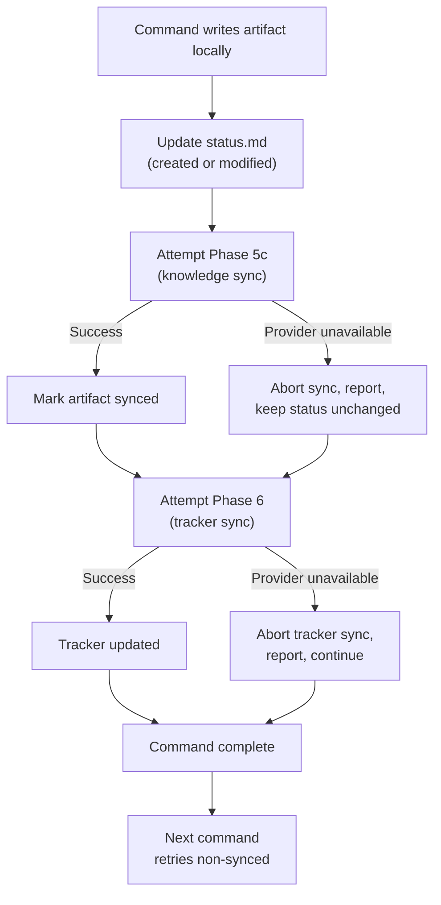

# Rho AIAS — Reference

## Tasks Base Directory

The tasks base directory is the root location where task artifact directories are stored. It is **configurable** to support multiple AI coding tools:

- **Resolution order**: `stack-profile.md` → `binding.generation.tasks_dir` → default `~/.cursor/plans/`
- **Default**: `~/.cursor/plans/` (backward compatible with Cursor)
- **Configuration**: Declare `binding.generation.tasks_dir` in `stack-profile.md` (see `aias/contracts/readme-stack-profile.md` § Generation Bindings Contract)

All commands and skills that reference artifact directories must use the **resolved tasks directory** — never hardcode `~/.cursor/plans/`.

---

## Handoff Model

Rho AIAS uses two complementary handoff layers:

- **Durable handoff** — TASK_DIR artifacts plus `status.md`. This is the source of truth across chats and modes.
- **Operational handoff** — `/handoff` emits a chat snippet that helps open the next chat with the right mode, command, and constraints.

Rules:
- Operational handoff MUST NOT replace artifact loading.
- When both exist, artifacts win over the snippet if there is any conflict.
- `/handoff` is optional workflow scaffolding, not a new artifact type.

---

## Per-Mode Artifact Requirements

Each mode declares which artifacts it **requires** (must be present) and which are **optional** (loaded if present, not an error if absent).

| Mode | Required artifacts | Optional artifacts |
|------|--------------------|--------------------|
| `@planning` | — | `*.product.md`, `*.issue.md`, `*.fix.md`, `*.assessment.md`, `*.plan.md`, `*.design.md` |
| `@product` | — | `*.product.md`, `*.design.md`, `*.plan.md`, `*.issue.md`, `*.fix.md`, `*.assessment.md` |
| `@dev` | `*.plan.md`, `*.design.md` | `*.product.md`, `*.fix.md`, `*.assessment.md`, `*.trace.md`, `*.issue.md` |
| `@qa` | `*.issue.md` | `*.trace.md`, `*.plan.md` |
| `@debug` | `*.fix.md`, `*.issue.md` | `*.plan.md` |
| `@review` | `*.plan.md` | `*.design.md`, `*.product.md` |
| `@delivery` | `*.charter.md` | `*.plan.md`, `*.product.md` |
| `@integration` | `*.plan.md` | — |
| `@devops` | — | `*.plan.md` |

> **Note on `@devops` activation globs:** `@devops` also activates on `*.yml` and `*.yaml` files (CI/CD file pattern triggers). These are activation-only globs — they do not introduce new artifact types beyond `*.plan.md`.

If a mode is activated and TASK_DIR is set, run Phases 0–3 of the skill loading protocol automatically. If TASK_DIR is not set, proceed normally without artifact context.

---

## Loading Order

When multiple artifacts are loaded, follow this order to build context correctly:

1. `status.md` — always first (establishes profile, state, and progress)
2. `*.product.md` — business context and requirements
3. `*.plan.md` files — `technical.plan.md` → `increments.plan.md` → `dor.plan.md` → `dod.plan.md`
4. `*.design.md` — UI/design specifications
5. `*.issue.md` — issue reports
6. `*.fix.md` — root cause analysis
7. `*.assessment.md` — feasibility evaluation
8. `*.charter.md` — delivery charter
9. `*.trace.md` — instrumentation plan
10. `*.publish.md` — Plan Delta (read-only, for reference)

---

## Writing Rules

When a command writes an artifact:

1. **Create** the file if it does not exist; **overwrite** if it does. Artifacts are not append-only.
2. **Update `status.md`** immediately after writing:
   - Add the filename to the `artifacts` map with status `created` (new) or `modified` (overwrite).
   - Update `completed_steps` and `current_step` if the writing completes a workflow step.
3. **Never write artifacts outside TASK_DIR.** Every artifact goes to `<resolved_tasks_dir>/<TASK_ID>/`.
4. **Never invent artifact types.** Only the 12 types in the closed catalog + `status.md` are allowed.
5. **Content language:** English for all artifact content. Use the **technical-writing** skill patterns.

### Todo `kind` enum (closed set, v9.5+)

When a `.plan.md` artifact under the Cursor-first profile carries todos in frontmatter, each todo MAY include a `kind` field with one of the following closed values:

- `validation` — gap in plan artifacts surfaced by `/validate-plan`; resolved by `/consolidate-plan` against the artifact named on the todo (typically `technical.plan.md`).
- `amendment_dor` — gap in DoR surfaced by `/blueprint` and registered by `/validate-plan` from `## Proposed DoR Amendments` in `technical.plan.md`; resolved by `/consolidate-plan` by applying to `dor.plan.md` and removing the corresponding entry from the Proposed section.
- `amendment_dod` — gap in DoD surfaced by `/blueprint` and registered by `/validate-plan` from `## Proposed DoD Amendments` in `technical.plan.md`; resolved by `/consolidate-plan` by applying to `dod.plan.md` and removing the corresponding entry.

**Backward compatibility:** if `kind` is absent in a todo entry, treat as `validation` (matches v9.4 and earlier behavior). Authors MAY safely add `kind` to existing todos in flight.

**Producer / consumer ownership:**

| Kind | Produced by | Consumed by | Body section in `technical.plan.md` |
|---|---|---|---|
| `validation` | `/validate-plan` | `/consolidate-plan` | n/a (resolved in artifact named on the todo) |
| `amendment_dor` | `/validate-plan` (from `## Proposed DoR Amendments`) | `/consolidate-plan` (applies to `dor.plan.md`, removes Proposed entry) | `## Proposed DoR Amendments` |
| `amendment_dod` | `/validate-plan` (from `## Proposed DoD Amendments`) | `/consolidate-plan` (applies to `dod.plan.md`, removes Proposed entry) | `## Proposed DoD Amendments` |

`increments.plan.md` todos do NOT use the `kind` field — they are execution todos produced by `/blueprint` and consumed by `/implement`.

#### TODO lifecycle (v9.6+)

`technical.plan.md` TODOs (kind `validation`, `amendment_dor`, `amendment_dod`) follow a **two-terminal-state** lifecycle:

- `pending` — initial state assigned by `/validate-plan` registration.
- `completed` — terminal state assigned by `/consolidate-plan` after the user accepts the Update Approval gate proposal and the artifact patch is applied. The TODO entry stays in `technical.plan.md` frontmatter (status switched to `completed`) and its bullet is removed from the Proposed section.
- **Deleted from frontmatter** — alternative terminal state. The TODO entry is **physically removed** from the `todos` array (the bullet is also removed from the body) when one of the following occurs:
  - `/enrich --refresh` Amendment Reconciliation sub-gate Case A (`confirm`) — the user chose `apply now (remove TODO)` because the refreshed tracker payload already encodes what the bullet was proposing.
  - `/enrich --refresh` Amendment Reconciliation sub-gate Case B (`contradict`) — the user chose `tracker wins (remove TODO)` because the refreshed tracker payload contradicts the bullet.

No `cancelled` terminal state exists. Audit trail for deletion lives in (1) `status.md command_log` (the `/enrich --refresh` invocation), (2) git history on `technical.plan.md` (if the task dir is under VCS), and (3) the knowledge provider's version history when the artifact was previously published (Phase 5c).

`increments.plan.md` execution todos retain their independent `pending → in_progress → completed` lifecycle managed by `/implement`.

---

## Workflow Profiles

Each task follows one of five profiles. The profile determines which steps are expected, which artifacts are produced, and which mode/chat to use at each step. Chat names identify the conversation — if the same chat name appears in multiple steps, those steps happen in the same chat session (one mode per chat, never mix modes).

### `feature` — New feature implementation

| Step | Chat | Mode | Command | Artifacts produced | Tracker transition (canonical) |
|------|------|------|---------|--------------------|-----------------|
| refinement | Chat Product | `@product` | `/enrich` | `analysis.product.md`, `dor.plan.md`, `dod.plan.md` | — (brief comment if `--brief`) |
| blueprint | Chat Planning | `@planning` | `/blueprint` | plan artifacts + `specs.design.md` | `ready` → `in_progress` |
| validate | Chat Planning | `@planning` | `/validate-plan` | — | — |
| consolidate | Chat Planning | `@planning` | `/consolidate-plan` (if gaps) | plan artifacts (updated) | — |
| implement | Chat Dev | `@dev` | `/implement` | — (code changes) | — |
| commit | Chat Dev | `@dev` | `/commit` | — | — |
| self-review* | Chat Review | `@review` | `/self-review` | — | — |
| pr | Chat Dev | `@dev` | `/pr` | — (PR created) | `in_progress` → `in_review` |
| closure | (any) | (any) | `/publish` or `/report` | `delta.publish.md` | — |

> \* Optional step; recommended for Standard and Critical plans.

### `bugfix` — Bug investigation and fix

| Step | Chat | Mode | Command | Artifacts produced | Tracker transition (canonical) |
|------|------|------|---------|--------------------|-----------------|
| investigate | Chat QA | `@qa` | `/issue` | `report.issue.md` | — |
| trace* | Chat QA | `@qa` | `/trace` | `instrumentation.trace.md` | — |
| trace-impl* | Chat Dev | `@dev` | implement trace plan (free instruction) | — (code changes) | — |
| trace-collect* | (manual) | — | run app, collect logs | — | — |
| trace-update* | Chat QA | `@qa` | update issue with logs | `report.issue.md` (updated) | — |
| analyze | Chat Debug | `@debug` | `/fix` | `analysis.fix.md` | — |
| assess | Chat Dev | `@dev` | `/assessment` | `feasibility.assessment.md` | — |
| blueprint | Chat Planning | `@planning` | `/blueprint` | plan artifacts, `dor.plan.md`, `dod.plan.md` (bug exception) | `pending_dor` → `in_progress` |
| validate | Chat Planning | `@planning` | `/validate-plan` | — | — |
| consolidate | Chat Planning | `@planning` | `/consolidate-plan` (if gaps) | plan artifacts (updated) | — |
| implement | Chat Dev | `@dev` | `/implement` | — (code changes) | — |
| commit | Chat Dev | `@dev` | `/commit` | — | — |
| pr | Chat Dev | `@dev` | `/pr` | — (PR created) | `in_progress` → `in_review` |
| report | Chat Dev | `@dev` | `/report` | — (RCA fields or fallback comment to tracker) | — |
| closure | (any) | (any) | `/publish` | `delta.publish.md` | — |

*Steps marked with * are conditional — only when more evidence is needed.

### `refactor` — Technical improvement

| Step | Chat | Mode | Command | Artifacts produced | Tracker transition (canonical) |
|------|------|------|---------|--------------------|-----------------|
| refinement | Chat Product | `@product` | `/enrich` | `analysis.product.md`, `dor.plan.md`, `dod.plan.md` | — (brief comment if `--brief`) |
| blueprint | Chat Planning | `@planning` | `/blueprint` | plan artifacts | `ready` → `in_progress` |
| validate | Chat Planning | `@planning` | `/validate-plan` | — | — |
| consolidate | Chat Planning | `@planning` | `/consolidate-plan` (if gaps) | plan artifacts (updated) | — |
| implement | Chat Dev | `@dev` | `/implement` | — (code changes) | — |
| commit | Chat Dev | `@dev` | `/commit` | — | — |
| pr | Chat Dev | `@dev` | `/pr` | — (PR created) | `in_progress` → `in_review` |
| closure | (any) | (any) | `/publish` or `/report` | `delta.publish.md` | — |

### `enrichment` — Ticket enrichment only (no implementation)

| Step | Chat | Mode | Command | Artifacts produced | Tracker transition (canonical) |
|------|------|------|---------|--------------------|-----------------|
| refinement | Chat Product | `@product` | `/enrich` | `analysis.product.md`, `dor.plan.md`, `dod.plan.md` | — (brief comment if `--brief`) |
| closure | (any) | (any) | `/publish` | `delta.publish.md` | — |

### `delivery` — Charter and viability assessment

| Step | Chat | Mode | Command | Artifacts produced | Tracker transition (canonical) |
|------|------|------|---------|--------------------|-----------------|
| charter | Chat Delivery | `@delivery` | `/charter` (with or without plans) | `delivery.charter.md` | — |
| closure | (any) | (any) | `/publish` | `delta.publish.md` | — |

### `spike` — Time-boxed investigation

Lightweight profile for exploration tasks with no predetermined implementation plan.

| Step | Chat | Mode | Command | Artifacts produced | Tracker transition |
|------|------|------|---------|--------------------|-------------------|
| refinement | Chat Product | `@product` | `/enrich` | `analysis.product.md`, `dor.plan.md` | — (brief comment if `--brief`) |
| investigate | Chat Dev | `@dev` | (free instruction) | — (code, notes, prototypes) | — |
| assess* | Chat Dev | `@dev` | `/assessment` | `feasibility.assessment.md` | — |
| closure | (any) | (any) | `/publish` | `delta.publish.md` | — |

\* `assess` is conditional — only when a formal feasibility record is needed. `/blueprint` is also optional, recommended only if the investigation yields a concrete implementation plan (feature or bugfix).

DoR uses the spike template from `/enrich` (lightweight: hypothesis, time-box, success criteria, out-of-scope).

---

## Step Definitions

Steps are tracked in `status.md` under `completed_steps` (array) and `current_step` (string).

| Step name | Trigger | Completion condition |
|-----------|---------|---------------------|
| `refinement` | `/enrich` completes | `analysis.product.md`, `dor.plan.md`, `dod.plan.md` written |
| `investigate` | `/issue` completes | `report.issue.md` written |
| `trace` | `/trace` completes | `instrumentation.trace.md` written |
| `analyze` | `/fix` completes | `analysis.fix.md` written |
| `assess` | `/assessment` completes | `feasibility.assessment.md` written |
| `blueprint` | `/blueprint` completes | All plan artifacts written |
| `validate` | `/validate-plan` verdict = "ready" | Plan validated, DoR/DoD alignment confirmed |
| `consolidate` | `/consolidate-plan` resolves all gaps | Plan artifacts updated |
| `implement` | `/implement` completes all increments | All increments done |
| `commit` | `/commit` completes | Changes committed |
| `pr` | `/pr` creates or updates PR | PR URL in context |
| `report` | `/report` completes | Bug RCA report generated (bugfix profile, optional step) |
| `charter` | `/charter` completes | `delivery.charter.md` written |
| `closure` | `/publish` or `/report` | Task archived per classification. |

---

## `status.md` Format

```yaml
profile: feature
classification: null
task_id: MAX-XXXXX
started: 2026-01-25
status: pending_dor
tracker_status: <provider:pending_dor_label>
completed_steps: []
current_step: refinement
refinement_validated: null
last_refreshed_at: null
rhoaias_update: null
published: null
completed: null
artifacts:
  analysis.product.md: created
command_log:
  - command: /enrich
    started_at: 2026-01-25T14:30:12Z
    ended_at: 2026-01-25T14:35:47Z
```

The `classification` field is `null` until `/blueprint` assigns it (`minor`, `standard`, or `critical`). See SKILL.md for classification criteria.
The `refinement_validated` field is `null` initially; set to `true` by `/enrich --brief` when brief comment is posted AND knowledge publish succeeds (team has context for refinement); `false` otherwise. Without `--brief`, `/enrich` always sets `refinement_validated: false`. `/enrich --refresh` does NOT modify this flag.

The `last_refreshed_at` field (v9.6+) is `null` initially; set to `<UTC ISO8601>` by `/enrich --refresh` when `Gate: Refresh Approval` returns `proceed` AND any DoR/DoD mutation was applied. When `--refresh` is aborted, skipped, or detects no drift, the field is NOT modified. The field is optional in legacy artifacts (pre-v9.6) and MAY be omitted from `status.md` until the first successful refresh. Consumers (e.g., `/blueprint` precondition gate, `/commit` advisory) MUST treat absent and `null` identically.

### RHOAIAS.md Freshness Tracking

The `rhoaias_update` field tracks whether `RHOAIAS.md` needs updating for the current task. Valid states:

| State | Set by | Meaning |
|-------|--------|---------|
| `null` | `/blueprint` (or absent by default) | Task does not impact RHOAIAS.md, or field not yet evaluated |
| `required` | `/blueprint` | Impact detected — RHOAIAS.md should be updated before PR |
| `deferred` | `/commit` gate | User acknowledged the need but chose to continue; silent in subsequent commits |
| `done` | Auto-detected by `/commit` or `/pr` | RHOAIAS.md was modified (present in `git status` or `git diff`) |
| `skipped` | `/pr` gate | User consciously chose not to update |

### Nested Context Discovery (v1.1)

When repositories provide nested `RHOAIAS.md` files, commands resolve context by walking up from current working directory to root:

1. Discover nearest `RHOAIAS.md` in current directory ancestry.
2. Discover root `RHOAIAS.md` (mandatory baseline).
3. Merge context with section-level precedence (deeper file wins on overlap).
4. Keep root-only sections (for example `Rho AIAS Integration`) from root baseline.

This preserves local specificity without duplicating full context in every subdirectory.

**Backward compatibility:** If the field is absent in an existing `status.md`, all commands MUST treat it as `null`. This field is not relevant to tracker sync and does not require an entry in `readme-tracker-field-mapping.md`.

### Command Log (Execution Telemetry)

The `command_log` field is an append-only list that records each command execution with timestamps:

```yaml
command_log:
  - command: /enrich
    started_at: 2026-01-25T14:30:12Z
    ended_at: 2026-01-25T14:35:47Z
  - command: /blueprint
    started_at: 2026-01-25T15:00:03Z
    ended_at: 2026-01-25T15:12:21Z
  - command: /self-review
    started_at: 2026-05-16T14:30:12Z
    ended_at: 2026-05-16T14:42:51Z
    dispatches:
      - subagent: aias-correctness-reviewer
        started_at: 2026-05-16T14:31:02Z
        ended_at: 2026-05-16T14:38:27Z
      - subagent: aias-reflector
        started_at: 2026-05-16T14:39:30Z
        ended_at: 2026-05-16T14:42:33Z
```

**Writing rules:**

1. Every command that writes to `status.md` MUST append an entry to `command_log`.
2. **Timestamp acquisition:** The agent MUST obtain timestamps via a system tool (`date -u +%Y-%m-%dT%H:%M:%SZ` or equivalent). If the environment does not permit shell access, use the date/time provided by the system context. MUST NOT invent or estimate timestamps — if a reliable timestamp cannot be obtained, write `started_at: null` and document the limitation.
3. **Single-write mechanic:** At command start, the agent obtains and retains the UTC timestamp internally (`started_at`). When writing/updating `status.md` (Phase 0, FILE OUTPUT, or Phase 5 depending on the command), the agent obtains a second timestamp and writes the complete entry with both `started_at` (retained value) and `ended_at` (current timestamp). This is one physical write operation.
4. **Format:** ISO 8601 UTC (`YYYY-MM-DDTHH:MM:SSZ`).
5. **Without TASK_DIR:** When `/commit`, `/pr`, or `/trace` execute without a resolved `TASK_DIR` (vibe coding / chat-only mode), the `command_log` entry is omitted. Those requests remain "unattributed" in CSV cost correlation.
6. **Re-execution:** Duplicate entries for the same command are expected when commands are re-executed (e.g., validate-consolidate-validate loops). Each execution appends independently.
7. **Multi-agent dispatch telemetry (v9.4+):** Commands that dispatch sub-agents (currently only `/self-review`) MAY include an OPTIONAL `dispatches: list[{subagent, started_at, ended_at}]` field on the `command_log` entry. The field captures one row per sub-agent invoked during multi-agent review. The host (the dispatching command) is the ONLY registrar — sub-agents MUST NOT write to `status.md` per `readme-multi-agent-review.md` § Sub-Agent Tool Boundary and § Dispatch Telemetry (host-owned). Absence of `dispatches` is backward-compatible (treat as empty list); it does NOT imply the command failed to dispatch. `/peer-review` MUST NOT write telemetry because it reviews other developers' work and does not assume `TASK_DIR` exists locally.

**Delineation with `completed_steps`:** `completed_steps` tracks workflow progression (which milestones are done). `command_log` tracks execution telemetry (when each command ran and how long it took). Both MUST be maintained independently — they serve different consumers (workflow engine vs cost attribution).

**Backward compatibility:** If `command_log` is absent in an existing `status.md`, treat it as an empty list. Its absence does not impact any existing workflow logic.

**Tracker mapping:** N/A — local-only field, not synced to any tracker provider.

### Governance Resolution (for `/implement`)

When `/implement` loads artifacts, it resolves effective governance from two sources:

1. `classification` from `status.md` → determines the baseline gate behavior.
2. `## Governance` section from `increments.plan.md` → defines custom per-increment gates (if present).

Resolution flowchart:
- Custom gate at a trigger point → fire custom gate (takes precedence).
- Else, classification baseline:
  - **Minor/Standard:** Feedback after each increment.
  - **Critical:** Approval before Increment 1; Feedback after each.
- Else (legacy — no `classification`): Feedback after each increment.

All interactive gates MUST use the `AskQuestion` tool as defined in `readme-commands.md` § Governance. See the same section for the canonical gate taxonomy, invocation protocol, and anti-bypass rules.

`tracker_status` stores the provider-resolved label, obtained from `providers.<active_provider>.status_mapping_source`.

## Tracker Mapping Resolution

Tracker transitions are defined in canonical form and resolved through provider mapping:

1. Load `aias-config/providers/tracker-config.md`.
2. Resolve `providers.<active_provider>.status_mapping_source`.
3. Load mapping file and resolve canonical transition targets.
4. Execute provider transition toward mapped target.
5. If config or mapping is missing/invalid/unresolvable, abort dependent tracker operation.

Ownership rules:

- `pending_dor → ready` is a **manual transition** (team responsibility during refinement). `/enrich` publishes artifacts to the knowledge provider and MAY post a brief comment (`--brief`) but does not change tracker status.
- `/blueprint` owns canonical transition `ready` -> `in_progress`.
- `/blueprint` (bug exception) owns canonical transition `pending_dor` -> `in_progress`.
- `/pr` owns canonical transition `in_progress` -> `in_review`.
- `/commit` is verification-only for `in_review` and does not own the primary transition.

Important boundary:

- The lifecycle below describes the internal task state stored in `status.md`.
- Tracker-side transitions are resolved via `status_mapping_source` and are limited by tracker boundary rules.
- **Terminal state governance:** The framework MUST NOT transition tracker state to `completed`/`DONE` or `cancelled` — these are exclusively human decisions owned by Product, QA, or Scrum leads. The framework's last automated tracker transition is `in_review` (via `/pr`). See `readme-tracker-status-mapping.md` § Terminal State Governance for the full rationale.

### Status lifecycle (6 states)

| Status | Meaning | Entered when |
|--------|---------|-------------|
| `pending_dor` | Artifacts being created, not ready for implementation | Task directory created |
| `ready` | All required artifacts present, validated | Manual team transition during refinement |
| `in_progress` | Implementation underway | `/blueprint` starts (Phase 0, after DoR/DoD verification) |
| `in_review` | PR created, awaiting feedback or approval | `/pr` creates PR |
| `completed` | All artifacts published, task archived | `/publish` completes |
| `cancelled` | Task abandoned | Manual action only |

### State transitions

```
pending_dor → ready        (manual team transition during refinement)
ready → in_progress        (/blueprint starts)
pending_dor → in_progress  (/blueprint bug exception — skips ready)
in_progress → in_review    (/pr creates PR)
in_review → in_progress    (PR needs changes, back to implementation)
in_review → completed      (/publish completes)
pending_dor → cancelled    (manual)
ready → cancelled          (manual)
in_progress → cancelled    (manual)
```

---

## Artifact Sync Status

Each artifact in the `artifacts` map has one of three sync states:

| Sync status | Meaning | Set when |
|-------------|---------|----------|
| `created` | Artifact exists locally, never published to resolved knowledge provider | Command writes a new artifact |
| `synced` | Artifact matches knowledge provider version | Phase 5c publishes successfully |
| `modified` | Artifact changed since last knowledge sync | Command overwrites an existing artifact |

### Sync rules

- Every artifact write sets status to `created` (new) or `modified` (overwrite of existing).
- Phase 5c publishes all artifacts with status `created` or `modified`.
- After successful publish, set status to `synced`.
- If publish fails due to provider unavailability: abort the dependent sync operation, report the issue, and keep artifact status unchanged.

---

## Resilience Model

Rho AIAS follows a **local-first** strategy: artifacts are always written to the local filesystem before any remote synchronization is attempted. Remote sync (knowledge provider, tracker) is secondary and never blocks command execution.

### Core Principle

Local artifact writes take priority over remote operations. A command that writes artifacts will always succeed locally, even if all remote providers are unavailable. Sync is eventual, not transactional.

### Resilience Flow



### Sync Behavior by Phase

| Phase | Provider | On failure | Retry mechanism |
|-------|----------|------------|-----------------|
| Phase 5c | Knowledge (Confluence, etc.) | Abort sync, report unavailability, keep artifact as `created`/`modified` | Implicit: next command that runs Phase 5c will attempt to publish all non-synced artifacts |
| Phase 6 | Tracker (Jira, etc.) | Abort tracker sync, report unavailability | Implicit: next command with tracker transition retries |

### Failure Scenarios

| Scenario | Behavior |
|----------|----------|
| Network error during Phase 5c | Abort sync; artifact remains `created`/`modified`; command completes normally |
| Provider returns 4xx/5xx | Same as network error: abort sync, report, continue |
| Provider timeout | Same as network error |
| Service config missing or invalid | Fail-fast before attempting sync; abort dependent operation, request correction |
| Provider available but page/issue not found | Abort that specific sync operation, report, continue with remaining operations |

### Reconciliation + Closure: `/publish`

The `/publish` command performs final reconciliation and closure. It re-runs Phase 5c for any remaining non-synced artifacts (idempotent) and generates the Plan Delta. This catches any artifacts that failed to sync during normal command execution.

### Key Guarantees

1. **No command blocks on remote failure** — local writes always succeed
2. **No data loss** — artifacts exist locally regardless of sync state
3. **Eventual consistency** — non-synced artifacts are retried on every subsequent Phase 5c execution
4. **Idempotent recovery** — `/publish` can be run at any time to force-sync all pending artifacts
5. **Status transparency** — `status.md` always reflects the true sync state of each artifact

---

## Commit Tag Convention

Commits produced within the rho-aias framework use an `[AI *]` prefix to distinguish AI-assisted work from manual commits. This enables traceability and quantification of AI-assisted development output.

### Format

| Context | Format | Example |
|---------|--------|---------|
| AI-assisted (TASK_DIR active) | `[AI TYPE]: description` | `[AI FEAT]: add checkout flow validation` |
| Manual (no TASK_DIR) | `[TYPE]: description` | `[FEAT]: add manual database migration` |

### Allowed types

`BUILD`, `CI`, `DOCS`, `FEAT`, `FIX`, `PERF`, `REFACTOR`, `STYLE`, `TEST`

With AI prefix: `AI BUILD`, `AI CI`, `AI DOCS`, `AI FEAT`, `AI FIX`, `AI PERF`, `AI REFACTOR`, `AI STYLE`, `AI TEST`

### Auto-detection

The `/commit` command applies the `[AI *]` prefix automatically when TASK_DIR is active and `status.md` exists. No manual intervention required.

### Quantification

For deeper analysis beyond AI vs manual:
- Commits with `[AI *]` that have an associated `status.md` with a complete workflow profile = **agent-driven** (structured, plan-based)
- Commits with `[AI *]` without a task directory = **ad-hoc AI assistance**
- Commits without the `AI` prefix = **manual**

This cross-reference can be automated without adding complexity to the commit tag itself.

---

## Structured Prompt — Artifact Reference Fields

The Structured Prompt supports file-reference fields that tell the agent to load specific artifacts as primary context. These are in addition to the standard fields (`MODE`, `REPO`, `TASK ID`, `TASK DIR`, `PROFILE`, `PLAN`, `FIGMA`, `CONTEXT`, `TASK`). `DIR` is an allowed alias for `TASK DIR`. `TICKET` remains a legacy alias for `TASK ID` when older prompts are used.

| Field | Artifact referenced | Use case |
|-------|--------------------|---------| 
| `PLAN: <name>` | `*.plan.md` files | Continue from an existing plan |
| `ISSUE: <filename>` | `report.issue.md` | Load issue report for context or update |
| `FIX: <filename>` | `analysis.fix.md` | Load fix analysis for context |
| `ASSESSMENT: <filename>` | `feasibility.assessment.md` | Load assessment for planning |
| `TRACE: <filename>` | `instrumentation.trace.md` | Load trace plan for implementation |

These fields resolve relative to TASK_DIR. Example:

```
MODE: @dev
TASK DIR: MAX-12850
FIX: analysis.fix.md
ISSUE: report.issue.md
TASK: /assessment
```

---

## Knowledge Sync Details

**Configuration source:** Resolve provider from `aias-config/providers/knowledge-config.md`.

### Generic publishing model

```
<knowledge-provider-target>/<TASK_ID>/
├── <parent artifact container>
├── technical.plan.md
├── increments.plan.md
├── analysis.product.md
├── ...
└── delta.publish.md
```

Provider-specific hierarchy derivation is owned by the resolved provider adapter (not by this skill protocol contract). Repeating hierarchy nodes and artifact pages MUST use provider-safe, scope-aware titles to avoid namespace collisions at the provider level (for example, task-scoped artifact titles prefixed with `<TASK_ID>`) — the exact format is defined by the resolved provider adapter.

### Title format invariant (cross-provider)

Phase 5c MUST emit titles exactly as specified in the resolved knowledge provider config. Title humanization is FORBIDDEN regardless of provider — substituting filenames with human descriptions, swapping canonical separators (em dash, en dash, slash, pipe, comma, middle dot, arrow), or re-casing scope segments breaks `findOrCreatePage` lookup determinism and produces silent duplicates on subsequent publishes.

The canonical title shapes are:

- Artifact pages: `<TASK_ID>: <artifact filename>` (e.g., `MAX-12345: dod.plan.md`, never `MAX-12345: Definition of Done`).
- Repeating hierarchy nodes: scope-aware titles defined by the provider config (e.g., `iOS: 2026: Q1`, never `iOS — 2026 — Q1`).

Every `createPage`/`updatePage` invocation MUST pass through the provider-specific pre-publish title validator (see `atlassian-mcp/SKILL.md` § Pre-publish Title Validation for the Confluence implementation; other providers declare equivalent validators sourced from their own publishing config). The validator aborts the call if the title does not match the canonical regex; the orchestrator re-derives the title from its canonical source and retries.

This invariant is governed by `readme-knowledge-publishing-config.md` § Rules § Title Canonicity (v1.1+).

### Progressive sync (Phase 5c) — Conditional (tracker-gated)

Phase 5c fires when a valid tracker ticket exists for TASK_ID (P1-P3 preconditions; see rho-aias SKILL.md § Phase 5c). It fires regardless of Plan Classification — the tracker-ticket check is the only prerequisite.

After verifying P1-P3 preconditions are met:

1. Resolve knowledge provider from `aias-config/providers/knowledge-config.md`:
   - Validate active provider, skill binding, provider enablement, and capability compatibility.
   - If config is missing/invalid/unresolvable: abort dependent sync operation and request provider configuration correction.
2. Read provider configuration to resolve publishing target and hierarchy metadata.
3. Read `status.md` artifacts map.
4. For each artifact with status `created` or `modified`:
   - Read the artifact file from TASK_DIR.
   - Use provider navigation/update algorithm to traverse hierarchy without creating duplicates.
   - For `created` artifacts: create or locate target artifact/page under `<TASK_ID>` and publish the **full publishable Markdown body** of the file.
   - For `modified` artifacts: locate existing artifact/page and update with the **full publishable Markdown body** of the file.
   - For Cursor-first `*.plan.md` artifacts, the publishable body excludes only the initial YAML frontmatter block when present.
   - For non-plan artifacts, publish the full file content.
   - **Never summarize, truncate, or abbreviate** artifact content when publishing. The knowledge provider page must contain the full human-readable document body.
5. After each successful artifact publish, inject a Table of Contents macro as defined in the resolved provider publishing config (MANDATORY when the config includes a Table of Contents section; see `readme-knowledge-publishing-config.md`). Read the published page in the provider's native format, insert the TOC element per the injection algorithm defined in the config, and update the page. This step is non-blocking — failure does not affect artifact sync status.
6. Set artifact status to `synced` on success.
7. On runtime provider failure: abort dependent sync operation, report provider unavailability, and keep status unchanged.

### `/publish` closure sync

`/publish` performs **reconciliation and closure** — it re-runs Phase 5c for all non-synced artifacts.

1. Reconciliation: re-run Phase 5c for all non-synced artifacts (idempotent).
2. Generate `delta.publish.md` and publish as child artifact/page.
3. Update parent container/dashboard with a completion summary (this is the ONLY page that receives a summary — all artifact pages contain the full file content).
4. Set `status: completed`, `completed: <date>`.
5. Post tracker comment with knowledge-link when provider supports comments.

### Fail-fast resolution guard

Use the same guard for every service-dependent sync step:

```text
resolveServiceOrAbort(category):
  load aias-config/providers/<category>-config.md
  validate schema + active provider + skill binding + capability
  if valid:
    continue
  abort dependent operation and request provider configuration
```
