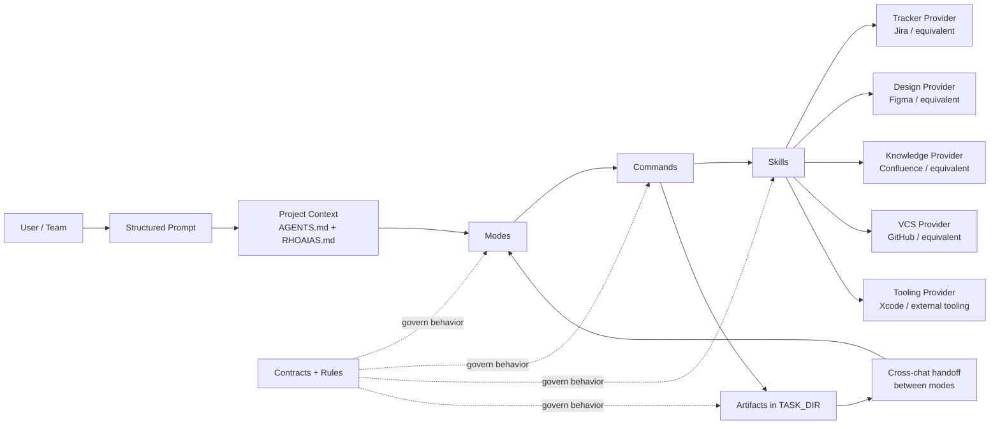

# Rho AIAS

*Rule-governed Human-Orchestrated* **A**gentic **I**nfrastructure for **A**rchitectural **S**tandards

*The seven-layered shield of agentic development.*

**Architecture, not better prompts, is the solution to reliable AI-assisted development.**

## Problem Statement

AI coding assistants are powerful, but power without structure produces inconsistent results. Teams adopt these tools expecting acceleration and instead encounter a recurring set of failures: context fragments across chat sessions, decisions made in one conversation are invisible in the next, and outputs vary unpredictably because nothing governs how the model should behave for a given task. The problem is not model capability. The problem is that the surrounding workflow has no architecture.

Without explicit contracts, modes, and artifact handoffs, every AI interaction starts from scratch. Engineers spend time re-explaining project conventions, manually normalizing outputs, and reconstructing decision history that was never captured. What should be a multiplier becomes overhead. Teams do not fail because the model cannot generate good code — they fail because there is no system ensuring that good code is generated consistently, in context, with traceability.

Rho AIAS treats this as an architectural problem. Instead of chasing better prompts, it defines a layered infrastructure where project context is explicit, agent behavior is governed by rules and modes, execution follows deterministic commands, and every output is a traceable artifact. The model can change. The workflow remains dependable.

## The Seven Layers

| Layer | Component | Purpose |
|---|---|---|
| 1 | **AGENTS.md** | Explicit project context |
| 2 | **Base Rules** | Universal agent behavior |
| 3 | **Modes** | Specialized reasoning stances |
| 4 | **Commands** | Deterministic execution |
| 5 | **Skills** | Reusable operational knowledge |
| 6 | **Contracts** | Architectural standards and governance |
| 7 | **Artifacts** | Verified, traceable outputs |

Each layer shields the development process from a specific class of failure. Context prevents hallucination. Rules prevent behavioral drift. Modes prevent reasoning misalignment. Commands prevent output inconsistency. Skills prevent knowledge fragmentation. Contracts prevent structural decay. Artifacts prevent decision loss.

## Architecture at a Glance



The framework keeps the reasoning layer, execution layer, and provider integrations separate. Modes define how to think, commands define how to execute, skills mediate provider-specific operations, and artifacts preserve state across chats.

## Quick Start

```bash
# 1. Clone the framework
git clone https://github.com/rho-aias/aias.git
cd your-project

# 2. Initialize your project
python3 aias/.canonical/generation/aias_cli.py init

# 3. Run your first blueprint
# In your AI coding tool:
# MODE: @planning
# TASK: Analyze the requirement. When done, /blueprint.
```

`aias init` walks you through creating your project context (`RHOAIAS.md`), stack profile, service configuration, and editor shortcuts. From there, you can plan, implement, review, and ship — all through structured commands.

For the full walkthrough, see [docs/QUICKSTART.md](docs/QUICKSTART.md).

## Multi-Tool Portability

| Tool | Rules | Modes | Commands | Skills | Context |
|---|---|---|---|---|---|
| **Cursor** | Full | Full | Full | Full | `AGENTS.md` → `RHOAIAS.md` |
| **Claude Code** | Full | Partial (`paths:`) | — | Full | `CLAUDE.md` → `RHOAIAS.md` |
| **Windsurf** | Full | — | — | — | `AGENTS.md` → `RHOAIAS.md` |
| **GitHub Copilot** | Full | Full (`applyTo:`) | Full (agents) | — | `AGENTS.md` → `RHOAIAS.md` |
| **Codex** | — | — | Full | Full | `codex.md` → `RHOAIAS.md` |
| **Gemini** | — | — | — | — | `GEMINI.md` → `RHOAIAS.md` |

Shortcuts are symlinks or enriched path references with zero content duplication — canonical sources live exclusively in `aias/`. Only tools listed in `binding.generation.tools` (stack profile) have shortcuts generated. See [contracts/readme-tool-adapter.md](contracts/readme-tool-adapter.md) for the full adapter contract.

## Mission

Rho AIAS exists to make AI-assisted development reliable enough for real engineering work. Most teams do not fail because they lack model capability; they fail because context is fragmented, decisions are hard to trace, and outputs are not governed by explicit standards. Rho AIAS addresses that gap by treating agent behavior as architecture, not as isolated prompt craft. The practical goal is to reduce ambiguity in AI workflows so teams can ship faster without sacrificing technical rigor — turning ad hoc chats into deterministic, contract-driven execution where each step has a role, a boundary, and an auditable artifact.

*For the complete brand identity, see [BRAND.md](BRAND.md).*

## Vision

Rho AIAS aims to become a distributable framework that any technical team can adopt, configure, and evolve across stacks, tools, and organizational contexts. It is not a closed methodology tied to one IDE or one provider — it is an open architectural standard for agentic development operations. Teams onboard by defining their constraints (platform, repositories, conventions, external services), then run a consistent workflow that remains stable as models and tools change. The framework is designed to be composable, inspectable, and maintainable by humans over time.

*For the complete brand identity, see [BRAND.md](BRAND.md).*

## Value Proposition

- Convert ad hoc AI interactions into deterministic workflows with explicit roles, contracts, and outputs.
- Preserve context and decisions through artifact-driven handoffs instead of fragile chat memory.
- Keep humans in governance loops while benefiting from accelerated execution.
- Enable long-running, multi-step work where planning, implementation, review, and closure remain connected.

## Target Audience

- Senior developers tired of re-explaining context and manually normalizing model output.
- Tech leads and staff engineers who need repeatable team behavior and auditability.
- Teams adopting AI assistants that want governance and quality controls from day one.
- Organizations with cross-repo or cross-platform delivery where consistency and traceability matter.

Less suitable for teams seeking pure prompt experimentation without process constraints.

## Documentation

- [Quick Start](docs/QUICKSTART.md) — From clone to first `/blueprint` in under 10 minutes
- [Changelog](CHANGELOG.md) — Current version, versioning policy, and release history
- [Architecture](docs/ARCHITECTURE.md) — The seven layers, data flow, and generation pipeline
- [Configuration](docs/CONFIGURATION.md) — Project context, stack profiles, services, and editor setup
- [Workflows](docs/WORKFLOWS.md) — End-to-end flows for features, bugs, enrichment, CI/CD
- [CLI Reference](docs/CLI.md) — `aias` subcommands, flags, and examples
- [Contributing](CONTRIBUTING.md) — How to extend the framework
- [Contracts](contracts/) — Canonical standards for all artifact types

## License

[TBD]
