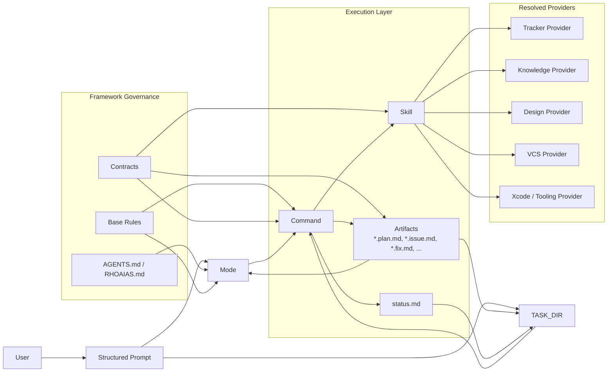
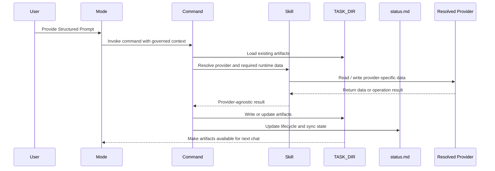

# Architecture Overview

Rho AIAS is built on seven architectural layers, each protecting the development process from a specific class of failure. This document explains those layers, the data flow between them, the generation pipeline, and the artifact lifecycle.

The name draws from Rho Aias — the legendary seven-layered shield. Each layer in the framework absorbs a category of ambiguity that would otherwise degrade AI-assisted development: missing context, inconsistent behavior, unconstrained reasoning, unstructured execution, fragmented knowledge, unverified standards, and untraceable outputs.

For brand identity, origin story, and positioning, see [BRAND.md](../BRAND.md).

---

## The Seven Layers

| Layer | Component | Purpose |
|---|---|---|
| 1 | **Project Context** | Makes project structure, conventions, and technologies explicit so the agent does not guess |
| 2 | **Base Rules** | Universal agent behavior that applies to every chat session |
| 3 | **Modes** | Specialized reasoning stances that define *how to think* about a task type |
| 4 | **Commands** | Deterministic execution that defines *how to execute* and structure output |
| 5 | **Skills** | Reusable operational knowledge for external services |
| 6 | **Contracts** | Canonical standards governing every artifact type |
| 7 | **Artifacts** | Verified, traceable outputs stored in task directories |

### Layer 1 — Project Context (AGENTS.md / RHOAIAS.md)

Project context is the first layer because everything downstream depends on it. Without explicit context, the agent fills gaps with assumptions — and assumptions compound across steps.

Two files carry this responsibility:

- **`AGENTS.md`** — The IDE-native context file (Cursor, Claude Code, Windsurf). Declares project structure, conventions, key technologies, and related documentation. Read automatically by the agent at session start.
- **`RHOAIAS.md`** — The framework-specific project context file. Declares stack, repositories, plans base directory, service bindings, and team conventions. Consumed by the `rho-aias` system skill during the loading protocol.

Release metadata is intentionally kept outside this layer: `aias/CHANGELOG.md` is the versioned source of truth for framework version and release history, while `AGENTS.md` remains focused on operational context for the agent.

Both files are maintained manually by the team. They change when the project changes, not when the framework changes.

Contract: `aias/contracts/readme-project-context.md`.

### Layer 2 — Base Rules

Base rules define universal agent behavior: language of response, coding standards, constraint enforcement, command and skill awareness. They apply to every chat session regardless of mode.

Base rules are split into two categories:

- **Invariant sections** — Behavior that is identical across all workspaces (e.g., language constraints, artifact protocol references). Defined in the canonical source `aias/.canonical/base-rule.md`.
- **Parametrizable sections** — Behavior that varies by stack profile (e.g., naming conventions, framework-specific patterns). Injected during generation from the stack profile bindings.

The generated output lives at `aias/.rules/base.mdc` in each workspace.

Contract: `aias/contracts/readme-base-rule.md`.

### Layer 3 — Modes

Modes define *how to think* about a task type. Each mode is a specialized reasoning stance with its own context enrichment rules, artifact expectations, and command availability.

Nine modes, organized in two categories:

**Core modes** (generated per workspace):

| Mode | Stance |
|---|---|
| `@planning` | Requirements analysis and decomposition |
| `@dev` | Implementation with code patterns and build integration |
| `@qa` | Testing, bug reporting, and quality verification |
| `@debug` | Root cause investigation and fix proposals |
| `@review` | Code review with architectural and standards focus |
| `@product` | Product analysis, competitive research, and enrichment |
| `@integration` | Cross-system integration and API contract work |

**Transversal modes** (not generated, shared across workspaces):

| Mode | Stance |
|---|---|
| `@delivery` | Ticket readiness assessment, effort estimation, and delivery viability |
| `@devops` | CI/CD pipeline configuration and infrastructure |

Canonical sources live in `aias/.canonical/`. Generated output goes to `aias/.modes/`.

Governance rule: **one mode per chat, never mixed**. Handoffs between modes happen across chats via artifact files in the task directory.

Contract: `aias/contracts/readme-mode-rule.md`.

### Layer 4 — Commands

Commands define *how to execute*. Where modes shape reasoning, commands structure action and format output. Every command has a defined contract, explicit inputs, and predictable outputs.

Two command types:

- **Type A (chat-only)** — Produces structured output within the chat. No side effects, no file writes, no service calls. Examples: `/explain`, `/guide`, `/copyedit`.
- **Type B (procedural)** — May write artifacts to the task directory, call external services, or trigger multi-step workflows. Examples: `/blueprint`, `/implement`, `/publish`, `/commit`.

Commands are invoked within a mode context. The mode provides the reasoning; the command provides the structure. A command without a mode is syntax without semantics.

The full command catalog lives in `aias/.commands/`. Current commands: `/aias`, `/assessment`, `/blueprint`, `/brief`, `/charter`, `/commit`, `/consolidate-plan`, `/copyedit`, `/enrich`, `/explain`, `/fix`, `/guide`, `/implement`, `/issue`, `/peer-review`, `/pr`, `/publish`, `/report`, `/run`, `/self-review`, `/spm`, `/test`, `/trace`, `/validate-plan`.

Contract: `aias/contracts/readme-commands.md`.

### Layer 5 — Skills

Skills are reusable packages of operational knowledge. They encapsulate how to interact with a specific domain or service so that modes and commands remain provider-agnostic.

Two skill categories:

- **MCP skills** — Wrap Model Context Protocol servers for external service interaction. Each skill is single-domain, stateless, and provider-specific. Current MCP skills: `atlassian-mcp`, `figma-mcp`, `github-mcp`, `xcode-mcp`.
- **Non-MCP skills** — Encode reusable reasoning patterns without external service dependencies. Current non-MCP skills: `technical-writing` (6 writing patterns), `incremental-decomposition` (6 decomposition rules).
- **System skill** — `rho-aias` is the framework's own skill. It defines the artifact catalog, loading protocol (7 phases), status lifecycle, workflow profiles, and sync behavior.

Skills live in `aias/.skills/`. They are consumed by modes and commands but never invoked directly by the user.

Immutability rule: MCP service skills only change on validated API, MCP, or security triggers — not on framework version bumps.

Contract: `aias/contracts/readme-skill.md`.

### Layer 6 — Contracts

Contracts are the single source of truth for every artifact type in the framework. There are 11 contracts in `aias/contracts/`, each governing a specific artifact family:

| Contract | Governs |
|---|---|
| `readme-commands.md` | Command definitions (Type A and Type B) |
| `readme-base-rule.md` | Base rules (invariant/parametrizable taxonomy) |
| `readme-output-contract.md` | Output contract rules (build system fragments) |
| `readme-mode-rule.md` | Mode rules (reasoning stance definitions) |
| `readme-skill.md` | Skills (MCP and non-MCP) |
| `readme-provider-config.md` | Service provider configuration and fail-fast resolution |
| `readme-tracker-status-mapping.md` | Tracker status mappings and trigger naming |
| `readme-artifact.md` | Task artifacts (naming, directory, lifecycle) |
| `readme-stack-profile.md` | Stack profiles (technology declarations and generation bindings) |
| `readme-tool-adapter.md` | Tool adapter shortcuts (multi-tool portability) |
| `readme-project-context.md` | Project context (RHOAIAS.md structure) |

Key principle: **if there is a conflict between implementation and contract, the contract wins**. Contracts change through explicit review, not implementation drift. No mode, command, skill, or rule may introduce behavior that contradicts its governing contract.

### Layer 7 — Artifacts

Artifacts are the verified, traceable outputs of the framework. Every command that produces structured work writes to a centralized task directory at `<resolved_tasks_dir>/<TASK_ID>/` (default: `~/.cursor/plans/<TASK_ID>/`).

The artifact catalog is closed — only types defined in the `rho-aias` system skill are permitted. Current catalog includes 12 artifact types (e.g., `.plan`, `.product`, `.issue`, `.fix`, `.charter`, `.trace`, `.assessment`, `.design`, `.publish`) plus the system file `status.md`.

Naming convention: `<name>.<suffix>.md` (e.g., `technical.plan.md`, `feasibility.assessment.md`). Artifacts are discovered by globbing their suffix, not by hardcoding names.

Artifacts serve as the handoff mechanism between modes. Since each mode runs in its own chat, artifacts in the task directory are the shared state that connects planning to implementation to review to closure.

Contract: `aias/contracts/readme-artifact.md`. Runtime details: `aias/.skills/rho-aias/SKILL.md`.

---

## Core Data Flow

The framework operates on a four-stage pipeline: **Structured Prompt -> Mode -> Command -> Artifact**.

### Detailed Interaction Map



This view separates the framework into four concerns:

- **Input and reasoning**: the user frames work through the Structured Prompt and the active mode.
- **Governance**: context, rules, and contracts constrain what the agent is allowed to do.
- **Execution**: commands write artifacts and call skills; `status.md` tracks lifecycle and sync state.
- **Providers**: external systems are reached only through skills, never as free-form direct integrations.

### Structured Prompt

The Structured Prompt is the primary input format. It declares the operating context for a chat session:

```
MODE: @planning
REPO: my-project
TASK ID: PROJ-123
TASK DIR: PROJ-123
TASK: Analyze the requirement. When done, /blueprint.
```

Optional fields reference existing artifacts:

```
ISSUE: analysis.issue.md
FIX: proposed.fix.md
ASSESSMENT: feasibility.assessment.md
TRACE: instrumentation.trace.md
```

### Flow

```
Structured Prompt
    |
    v
Mode (reasoning stance)
    |  - Loads context: AGENTS.md, RHOAIAS.md, base rules, task artifacts
    |  - Applies mode-specific enrichment rules
    |  - Determines applicable commands and skills
    |
    v
Command (structured execution)
    |  - Validates inputs against command contract
    |  - Executes defined phases/steps
    |  - Formats output per command specification
    |
    v
Artifact (traceable output)
       - Written to task directory with tracked status
       - Synced progressively to knowledge provider
       - Available for consumption by subsequent modes/commands
```

### Cross-Mode Handoffs

Since each mode operates in its own chat session, handoffs between modes happen through the task directory:

1. `@planning` produces `technical.plan.md` via `/blueprint`
2. A new chat in `@dev` loads the plan artifact during the loading protocol
3. `@dev` executes `/implement` against the loaded plan
4. A new chat in `@review` loads the implementation artifacts for `/self-review` or PR context for `/peer-review`

The task directory is the shared state. `status.md` tracks which phase the task is in.

### Provider-Mediated Execution Sequence



This sequence captures the core invariant of Rho AIAS: provider-specific operations are mediated by skills, while commands remain structured and artifacts remain the durable handoff layer between chats.

---

## Generation Pipeline

The generation pipeline transforms canonical sources into workspace-specific modes, rules, and tool shortcuts. It ensures deterministic output through pre-flight validation gates.

### Inputs

- **Canonical sources** (`aias/.canonical/`): 7 mode templates (`.mdc`), 2 transversal modes, `base-rule.md`, `output-contract.md`
- **Stack profile** (`stack-profile.md` at repo root): declares technology stack, capabilities, and generation bindings (`binding.rule.base.*`, `binding.rule.output_contract.*`, `binding.mode.*`)
- **Stack fragment** (`stack-fragment.md` at repo root): build system integration content injected into the output contract rule

### Generator

The generator script (`aias/.canonical/generation/generate_modes_and_rules.py`) reads canonical sources, resolves the stack profile and fragment, validates inputs, and produces outputs:

**Outputs:**

- `aias/.modes/*.mdc` — Platform-specific mode rules
- `aias/.rules/*.mdc` — Workspace rules (base + output-contract + continuous-improvement)
- Tool-specific shortcuts (with `--shortcuts` flag) for Cursor, Claude Code, Windsurf, GitHub Copilot, Codex

### Validation Gates

**Pre-flight gates** (run before generation):

| Gate | Validates |
|---|---|
| G0 | Infrastructure — canonical directories and required files exist |
| G1 | Profile discovery — stack profile found and parseable |
| G2 | Mode bindings — all mode references in the profile resolve to canonical templates |
| G3 | Rule bindings — all rule references in the profile resolve to canonical sources |
| G4 | Fragment validation — stack fragment found and structurally valid |
| G5 | Output directories — target output directories exist or can be created |

**Post-flight gates** (run after generation):

| Gate | Validates |
|---|---|
| G6 | Shortcut consistency — all generated shortcuts reference valid canonical files |
| G7 | Zero content duplication — shortcuts are references, not copies |

If any pre-flight gate fails, generation aborts with a diagnostic message. Post-flight failures produce warnings for manual review.

### CLI

The `aias` CLI (`aias/.canonical/generation/aias_cli.py`) provides four subcommands:

- `aias init` — Interactive project setup (RHOAIAS.md, stack profile, fragment, generation)
- `aias new` — Scaffold individual artifacts (mode, command, skill, rule)
- `aias generate` — Run the generation pipeline
- `aias health` — Validate workspace integrity

See [CLI Reference](CLI.md) for full documentation.

---

## Contract Model

Contracts are Markdown documents in `aias/contracts/` that define the canonical structure, rules, and quality criteria for every artifact type. They are written for maintainers, not for runtime consumption.

### Contract Anatomy

Each contract typically contains:

- **Purpose** — What the contract governs and why it exists
- **Design rules** — Structural requirements (naming, sections, fields)
- **Quality criteria** — Definition of done for compliance
- **Examples** — Contract-compliant and non-compliant samples
- **Source of truth delegation** — What the contract owns vs. what it delegates to skills or other contracts

### Contract Authority

The authority chain is:

```
Contract (defines the standard)
    |
    v
Canonical source (implements the standard)
    |
    v
Generated output (derived from canonical source)
    |
    v
Tool shortcut (references generated output)
```

Changes flow top-down. A generated file never overrides its canonical source, and a canonical source never contradicts its contract. When drift is detected, the implementation is corrected to match the contract — not the other way around.

### Contract Interactions

Contracts are independent but interconnected:

- `readme-commands.md` references `readme-artifact.md` for output file conventions
- `readme-mode-rule.md` references `readme-skill.md` for skill consumption rules
- `readme-stack-profile.md` references `readme-base-rule.md` and `readme-output-contract.md` for rule binding formats
- `readme-tool-adapter.md` references all output contracts for shortcut generation rules

---

## Artifact Lifecycle

Task artifacts go through a lifecycle tracked by `status.md` in the task directory.

### Task States

| Status | Meaning | Entered when |
|---|---|---|
| `pending_dor` | Artifacts being created | Task directory created |
| `ready` | All required artifacts validated | `/validate-plan` passes |
| `in_progress` | Implementation underway | `/implement` starts first increment |
| `in_review` | PR created | `/pr` creates pull request |
| `completed` | All artifacts published | `/publish` completes |
| `cancelled` | Task abandoned | Manual action only |

Transitions are directional. The typical forward path is: `pending_dor` -> `ready` -> `in_progress` -> `in_review` -> `completed`. The `cancelled` state is reachable from any state but only through manual intervention.

### Artifact Sync States

Each artifact tracks its own sync state relative to the configured knowledge provider:

| Sync State | Meaning |
|---|---|
| `created` | Written to disk, not yet synced |
| `synced` | Published to knowledge provider, content matches |
| `modified` | Local content changed after last sync |

### Progressive Knowledge Sync

Artifacts are published progressively — after every command that writes to the task directory, not only at the end. This means the knowledge provider stays current throughout the task lifecycle. `/publish` serves as the safety net for final archival, ensuring all artifacts reach `synced` state before the task is marked `completed`.

### Plan Classification

Plans are classified at creation time by `/blueprint` based on complexity:

| Class | Scope | Typical artifacts |
|---|---|---|
| A | Small, single-increment | Plan only |
| B | Medium, multi-increment | Plan + design |
| C | Large, cross-system | Plan + design + charter |

Classification can be escalated by `/charter` but never downgraded. It determines the minimum artifact set required before `/validate-plan` can pass.

---

## Service Abstraction

Rho AIAS decouples external providers from command and mode behavior through a category-based service layer. Consumers resolve integrations by category, not by provider name.

### Service Categories

| Category | Purpose | Example Provider |
|---|---|---|
| `knowledge` | Publishing and archive | Confluence |
| `tracker` | Task and issue tracking | Jira |
| `design` | Design context retrieval | Figma |
| `vcs` | Version control and PR metadata | GitHub |

### Resolution

Each category has a configuration file in `aias-providers/`:

- `aias-providers/knowledge-config.md`
- `aias-providers/tracker-config.md`
- `aias-providers/design-config.md`
- `aias-providers/vcs-config.md`

Commands and modes reference the category (e.g., "resolve tracker config"), not the provider (e.g., "call Jira API"). The service config file declares the active provider, the bound skill, and any provider-specific fields.

### Fail-Fast Policy

If a service config is missing, invalid, or unresolvable, the dependent operation aborts immediately with a diagnostic message. No fallback, no silent degradation. This ensures that provider misconfiguration surfaces at invocation time, not in corrupted artifacts.

For tracker transitions, the active provider must also expose a valid `status_mapping_source` so canonical task states resolve to provider-specific labels deterministically.

See [Service Abstraction](SERVICE-ABSTRACTION.md) for full coverage details.

---

## Resilience Model

The framework is local-first. Artifacts always exist on disk in the task directory regardless of sync state. Provider failures (knowledge base unreachable, tracker API down, VCS timeout) do not block local work.

The practical implications:

- **Artifact creation** never depends on network availability
- **Progressive sync** is best-effort; failures are logged but do not halt execution
- **Final sync** via `/publish` retries and reports any artifacts that could not reach `synced` state
- **Status tracking** in `status.md` reflects local state, not provider state

This means a practitioner can complete an entire planning-to-implementation cycle offline. Sync catches up when connectivity is restored.

For the complete resilience model, including failure scenarios and recovery procedures, see `aias/.skills/rho-aias/reference.md`.

---

## Related Documentation

- [Quick Start](QUICKSTART.md) — Getting started with the system
- [Configuration](CONFIGURATION.md) — Project context, stack profiles, services, and editor setup
- [Workflows](WORKFLOWS.md) — End-to-end workflow documentation
- [CLI Reference](CLI.md) — CLI subcommands, flags, and examples
- [Contributing](../CONTRIBUTING.md) — How to extend the framework
- [Service Abstraction](SERVICE-ABSTRACTION.md) — Service layer details and coverage
- [Commit and Workspace](COMMIT-AND-WORKSPACE.md) — How `/commit` resolves the repository
- [Adoption, Feedback, and Metrics](ADOPTION-FEEDBACK-AND-METRICS.md) — Quantification and feedback loops
