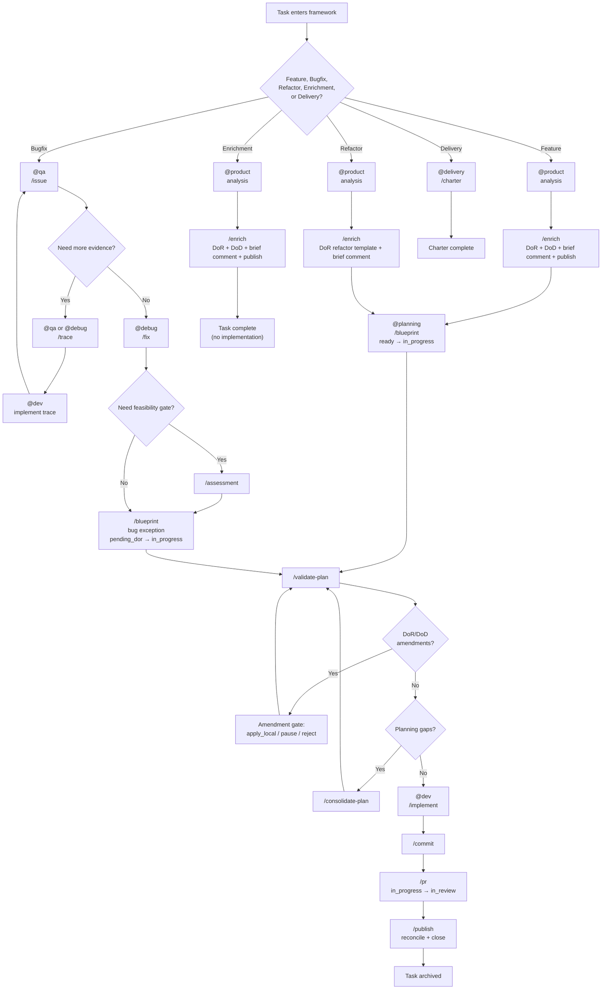

# Workflows — End-to-End Guide

This document describes the complete workflows for common development tasks using Rho AIAS modes and commands. It reflects the **v8.0** architecture with unified task directories, Plan Classification, tracker sync, unconditional knowledge-provider publishing, and separated refinement/planning phases.

---

## Overview

### One mode per chat (agent model)

- **Each chat is treated as a single specialized agent:** one mode per chat, plus the base rules that always apply. Modes are not mixed in the same chat, to avoid confusing the model.
- **Commands that generate artifacts** (e.g. `/blueprint`, `/issue`, `/fix`) do two things: (1) **Expose** output so a human knows what to do or what's happening; (2) **Provide context** to another chat/agent/mode. For example, plan artifacts from `@planning` + `/blueprint` are used as context in a different chat with `@dev`; `report.issue.md` from `@qa` + `/issue` is used as context in a different chat with `@debug`.
- Handoffs between modes happen **across chats**: one chat produces an artifact (via a command); that file is then used as input/context in another chat where a different mode runs.
- `/handoff` is an optional **operational** handoff aid: it can generate a reusable Markdown snippet for the next chat, but it never replaces TASK_DIR artifacts as the durable handoff layer.

### Structured Prompt (primary workflow)

See [QUICKSTART.md § Structured Prompt](QUICKSTART.md#structured-prompt-primary-workflow) for the canonical format definition, field descriptions, and examples. Commands can be chained in TASK: "When done, /blueprint." or "When done, /blueprint. When blueprint is done, /validate-plan."

### Interactive Gates (Structured UX)

Commands use a **structured interactive mechanism** for gates. `AskQuestion` is canonical when the runtime exposes it; otherwise the same gate must be projected through the **Text Gate Protocol** defined in `readme-commands.md`. This replaces ad-hoc text prompts such as `(yes / adjust)` pseudo-gates.

**Gate types:** Confirmation, Decision, Feedback, Approval, Precondition. Each gate follows the Gate Invocation Protocol: Context → Gate → Action.

Key gates across the workflow:
- `/enrich` — Classification Comprehension (when classification is ambiguous), Tracker Write Preview (before writing to tracker), DoR Readiness Check (before writing DoR/DoD)
- `/blueprint` — Comprehension (skippable with `--fast`), Preview (always fires)
- `/validate-plan` — Amendment Approval (when DoR/DoD amendments proposed), Validation Result
- `/consolidate-plan` — Update Approval (technical artifacts), Amendment Approval (DoR/DoD artifacts)
- `/implement` — Ready, Pre-Implementation Approval (Critical), Inter-Increment Feedback
- `/pr` — PR Confirmation (before creating/updating a PR)
- `/publish` — Publish Confirmation (before publishing)
- `/commit` — Branch Safeguard (when on main/master/develop)
- `/report` — Evidence Sufficiency (when RCA fields lack supportable values), Tracker Publish (before publishing RCA)
- Artifact-producing commands — Artifact Preview (before writing files to TASK_DIR)

See `readme-commands.md` § Governance for the full gate taxonomy and gate invocation protocol.

### Two-message pattern (alternative)

For tasks where you want to **review and correct** the agent's reasoning before it produces the final artifact:

1. **Message 1:** Mode (`@mode`) + TASK → Generates raw data (review it)
2. **Message 2:** Command (`/command`) → Structures the reviewed data into formatted output

Use this when you need maximum control over the reasoning step before committing to an artifact.

---

## Workflow Map



This map is intentionally high level. The detailed sections below define exact mode boundaries, command sequencing, optional branches, and expected outputs.

---

## Feature Development Flow

Complete workflow from planning to implementation to PR and closure.

### Step 1: Product Analysis + Refinement

```
MODE: @product
REPO: mobilemax-dev
TASK ID: PROJ-123
CONTEXT: Ticket is vague — only says "Add export button to reports".
         No acceptance criteria, no design, no scope.
TASK: Analyze with product frameworks (JTBD, 5 Whys, User Journey, MoSCoW).
      When done, /enrich PROJ-123.
```

**Expected Output:**
- Product analysis (JTBD, 5 Whys, User Journey, MoSCoW) → Gap Summary → Enhanced content
- `analysis.product.md`, `dor.plan.md`, `dod.plan.md` written to `<resolved_tasks_dir>/<TASK_ID>/`
- DoR Readiness Check gate with blocking/non-blocking classification
- Structured fields MAY be written to the resolved tracker provider after user confirmation
- All artifacts published to knowledge provider (Phase 5c unconditional)
- Canonical transition **pending_dor → ready** (after successful publish)

---

### Step 2: Planning + Blueprint

```
MODE: @planning
REPO: mobilemax-dev
TASK ID: PROJ-123
TASK DIR: PROJ-123
FIGMA: <url if available>
CONTEXT: <what was requested and any relevant background>
TASK: Analyze the requirement. When done, /blueprint.
```

Use `/blueprint --fast` for trivial or well-understood tasks.

**Precondition:** `dor.plan.md` and `dod.plan.md` must exist in TASK_DIR (from `/enrich`), except for bug flow with assessment artifacts.

**Expected Output:**
- Plan artifacts written to `<resolved_tasks_dir>/<TASK_ID>/`:
  - `technical.plan.md`, `increments.plan.md`
  - `specs.design.md` (when Figma context exists)
- Proposed DoR/DoD amendments in `technical.plan.md` (if gaps detected)
- Canonical transition **ready → in_progress** (provider-mapped)
- `status.md` updated: `status: in_progress`

---

### Step 3: Plan Validation

```
/validate-plan
```

**Expected Output:**
- Validation verdict: "Plan ready for implementation" or list of gaps
- Amendment gate (if amendments proposed): `apply_local` / `pause` / `reject`
- `status.md` updated: `current_step: implement` (status remains `in_progress`)

---

### Step 4: Implementation

```
MODE: @dev
REPO: mobilemax-dev
TASK DIR: PROJ-123
TASK: /implement
```

**Expected Output:**
- Code implemented increment by increment with governance-driven AskQuestion gates
- Governance resolved from classification (status.md) and custom gates (increments.plan.md)
- Each increment verified via Inter-Increment Feedback gate before proceeding
- `status.md` updated: `current_step: implement`

---

### Step 5: Commit

```
/commit
```

**Expected Output:**
- Each file committed independently with proper messages
- If open PR detected for current branch: verifies canonical tracker status is **in_review** (no-op if already there)
- If unpublished artifacts exist: nudge to run `/publish`

---

### Step 6: Create PR

```
/pr --create develop
```

**Expected Output:**
- PR description with Title, Purpose, Summary, Implementation Details, Testing, Risk Assessment
- **Plan Delta** section (when TASK_DIR available): compares planned increments vs actual implementation
- Canonical transition **in_progress → in_review** (provider-mapped)
- `status.md` updated: `status: in_review`, `current_step: closure`
- If unpublished artifacts exist: nudge to run `/publish`

---

### Step 7: Publish (Task Closure)

```
/publish
```

**Expected Output:**
- All artifacts with sync status `created` or `modified` published to resolved knowledge provider
- `delta.publish.md` generated and published in provider hierarchy
- `status.md` updated: `status: completed`, `completed: <date>`, `published: <date>`
- Closure data posted through the resolved tracker provider (no status transition — `completed` remains outside automatic framework transitions)

---

## Delivery Assessment (Optional)

For complex features, assess readiness before implementation:

```
MODE: @delivery
TASK DIR: PROJ-123
TASK: Assess readiness. When done, /charter.
```

**Expected Output:**
- `delivery.charter.md` written to `<resolved_tasks_dir>/<TASK_ID>/`
- Contains: Executive Summary, Readiness, Effort Estimation, Viability, Impact, Dependencies & Risks, Mermaid diagrams, Recommendation

---

## Bug Fix Flow

Complete workflow from bug discovery to fix implementation. Steps marked with * are conditional — only when more evidence is needed.

### Step 1: QA Bug Reporting (Chat QA)

```
MODE: @qa
REPO: mobilemax-dev
TASK ID: MAX-12850
TASK DIR: MAX-12850
CONTEXT: <describe the bug, environment, reproduction steps, evidence>
TASK: Analyze the bug. When done, /issue.
```

**Expected Output:**
- `report.issue.md` written to `<resolved_tasks_dir>/<TASK_ID>/`

---

### Step 2*: Trace Planning (Chat QA — same chat)

Only when more evidence is needed:

```
TASK: Create an instrumentation plan to collect more evidence. When done, /trace.
```

**Expected Output:**
- `instrumentation.trace.md` written to `<resolved_tasks_dir>/<TASK_ID>/`

---

### Step 3*: Trace Implementation (Chat Dev)

New chat:

```
MODE: @dev
REPO: mobilemax-dev
TASK DIR: MAX-12850
TRACE: instrumentation.trace.md
TASK: Implement the trace plan.
```

**Expected Output:**
- Code changes (instrumentation added)

---

### Step 4*: Collect Logs and Update Issue (Chat QA — same as Step 1)

Run the app, collect logs, then return to Chat QA:

```
ISSUE: report.issue.md
TASK: Update the issue report with these logs: <paste logs>
```

**Expected Output:**
- `report.issue.md` updated with log evidence

---

### Step 5: Debugging (Chat Debug)

New chat:

```
MODE: @debug
REPO: mobilemax-dev
TASK DIR: MAX-12850
CONTEXT: See issue at <resolved_tasks_dir>/MAX-12850/report.issue.md
TASK: Analyze root cause. When done, /fix.
```

**Expected Output:**
- `analysis.fix.md` written to `<resolved_tasks_dir>/<TASK_ID>/`

---

### Step 6: Assessment (Chat Dev)

New chat:

```
MODE: @dev
REPO: mobilemax-dev
TASK DIR: MAX-12850
FIX: analysis.fix.md
ISSUE: report.issue.md
TASK: /assessment
```

**Expected Output:**
- `feasibility.assessment.md` written to `<resolved_tasks_dir>/<TASK_ID>/`

---

### Step 7: Planning (Chat Planning)

New chat:

```
MODE: @planning
REPO: mobilemax-dev
TASK DIR: MAX-12850
ASSESSMENT: feasibility.assessment.md
ISSUE: report.issue.md
FIX: analysis.fix.md
TASK: Create implementation plan. When done, /blueprint. When blueprint is done, /validate-plan.
```

If `/validate-plan` finds gaps, use `/consolidate-plan` to resolve them one by one. In the bug flow, `/blueprint` generates DoR/DoD via the bug exception (derived from assessment artifacts).

**Expected Output:**
- Plan artifacts in TASK_DIR (with classification assigned)
- Canonical transition: `/blueprint` → `in_progress` (provider-mapped)

---

### Step 8: Implementation + PR (Chat Dev — same as Step 6)

```
TASK: /implement
```

After implementation: `/commit` → `/pr` → optional `@review` + `/peer-review` → `/report`

**Expected Output:**
- Production-ready fix implementation
- Canonical transition: `/pr` → `in_review` (provider-mapped)
- Optional peer review findings plus VCS-ready review comment snippets
- Bug fix report summary posted to resolved tracker provider

---

### Step 9: Closure

`/publish` to reconcile any remaining artifacts, generate delta, and formally close the task. Since Phase 5c is unconditional, most artifacts will already be published progressively.

---

## Integration Flow

Coordinating changes across multiple repositories (MobileMax, RDSUI, RDSNetworking, RDSMacros).

### Step 1: Planning Integration

```
MODE: @planning
TASK DIR: integration-rdsnetworking-upgrade
CONTEXT: RDSNetworking has breaking API changes that affect MobileMax
         and RDSMacros. Need to coordinate the upgrade.
TASK: Plan the integration. When done, /blueprint.
```

**Expected Output:**
- Plan artifacts written to `<resolved_tasks_dir>/<TASK_ID>/`

---

### Step 2: Coordination

New chat:
```
MODE: @integration
TASK DIR: integration-rdsnetworking-upgrade
TASK: Coordinate the changes across repositories according to the plan.
```

**Expected Output:**
- API compatibility analysis, coordination strategy, validation checklist

---

### Step 3: Validation

```
MODE: @integration
CONTEXT: <describe what was changed in each repo>
TASK: Validate that all repositories work together.
```

**Expected Output:**
- Validation results, integration test recommendations, remaining issues

---

## Log Instrumentation Flow

Generating a structured log instrumentation plan for tracing execution flows.

### Step 1: Generate Trace Plan

```
MODE: @qa
REPO: mobilemax-dev
TASK DIR: <task-id>
CONTEXT: Need to trace the login flow to understand what's happening.
TASK: Analyze the flow in LoginViewModel.swift and LoginView.swift.
      When done, /trace LoginViewModel.swift LoginView.swift.
```

**Expected Output:**
- Markdown code snippet with instrumentation points (entry/exit, error paths, state mutations, lifecycle hooks)
- `instrumentation.trace.md` written to TASK_DIR when TASK_DIR is set

### Step 2: Implement Logs

New chat:
```
MODE: @dev
REPO: mobilemax-dev
CONTEXT: <paste trace plan snippet from Step 1>
TASK: Implement the log instrumentation plan.
```

### Step 3: Clean Up (after debugging)

Once the issue is resolved, remove all instrumentation logs. The `Log` utility file itself is temporary.

---

## Ticket Enrichment Flow

Analyzing and enriching vague tracker tickets with product and technical detail.

```
MODE: @product
TASK ID: MAX-12761
TASK DIR: MAX-12761
CONTEXT: Ticket is vague — only says "Add export button to reports".
         No acceptance criteria, no design, no scope.
TASK: Analyze with product frameworks (JTBD, 5 Whys, User Journey, MoSCoW).
      When done, /enrich MAX-12761.
```

**Expected Output:**
- Product analysis (JTBD, 5 Whys, User Journey, MoSCoW) → Gap Summary → Enhanced content
- `analysis.product.md`, `dor.plan.md`, `dod.plan.md` written to `<resolved_tasks_dir>/<TASK_ID>/`
- DoR Readiness Check gate with blocking/non-blocking classification
- Confirmation prompt before writing enriched fields to the resolved tracker provider (`Description`, Acceptance Criteria, Test Steps, priority, components)
- `Enhanced by` headers are applied only to the remote tracker payload, not to the local artifact
- Full local analysis stays in `analysis.product.md`; the tracker receives a curated field-by-field representation
- All artifacts published to knowledge provider (Phase 5c unconditional)
- Canonical transition `pending_dor → ready` (after successful publish)

**Result:**
- Tracker ticket enriched with missing product and technical detail through field updates, without local-path comments
- DoR/DoD artifacts ready for `@planning` + `/blueprint`
- Enriched artifact can feed into `@planning` + `/blueprint`

---

## Exploration Flow

Exploring conceptual solutions, future-facing approaches, or product analysis.

```
MODE: @product
CONTEXT: <what you're trying to understand and why>
TASK: Explore <topic or question>.
```

**Expected Output:**
- Conceptual or ideal solutions (speculative content labeled)
- Separation between what can be implemented today vs future concepts
- When analyzing requirements: product frameworks (JTBD, 5 Whys, User Journey, MoSCoW)

### Concept Learning (any mode)

```
/explain <topic or question>
/explain async/await in Swift --quiz
```

**Expected Output:**
- Concept Summary, Alternatives, Mental Model, optional Quiz

---

## Review and Handoff Flow

Use `@review` when the goal is correctness, risk detection, and readiness assessment rather than implementation.

### Local review before PR

```
MODE: @review
REPO: mobilemax-dev
TASK DIR: MAX-12850
TASK: Review the current branch changes. When done, /self-review.
```

**Expected Output:**
- Severity-ordered findings in chat
- Explicit readiness verdict for peer review / PR
- No VCS-ready snippets, because there is no remote diff anchor

### PR / third-party review

```
MODE: @review
TASK ID: MAX-12850
TASK: Review PR 482. When done, /peer-review 482.
```

**Expected Output:**
- Severity-ordered findings in chat
- VCS-ready snippets with `File`, `Applies to diff`, and copy-paste review comments
- One PR-level general review comment

### Operational handoff between chats

Use `/handoff` when the next chat needs a compact startup payload in addition to TASK_DIR artifacts.

```
/handoff -m @planning -c /blueprint
```

**Expected Output:**
- One reusable Markdown snippet with mode, command, context, goal, constraints, and expected output
- Explicit assumptions when destination resolution is partial or inferred
- No file writes and no replacement of artifact loading

---

## CI/CD Pipeline Flow

Configuring and troubleshooting CI/CD pipelines, private dependency resolution, and build orchestration.

**Diagnose a failure:**
```
MODE: @devops
REPO: mobilemax-dev
CONTEXT: CircleCI build fails — cannot resolve private dependency RDSUI.
TASK: Diagnose and fix the pipeline configuration.
```

**Set up a new pipeline:**
```
MODE: @devops
REPO: mobilemax-android
CONTEXT: Need CI with build, test, lint. Depends on private repos: RDSUI, RDSNetworking.
TASK: Set up a GitHub Actions pipeline with proper private dependency resolution.
```

**Expected Output:**
- Diagnosis / pipeline config created or modified
- Private dependency access configured
- Secrets referenced by mechanism (never hardcoded)

---

## status.md Lifecycle

Every task directory contains a `status.md` system file that tracks progress, tracker sync, and artifact sync state.

### Format

```yaml
profile: feature
task_id: MAX-XXXXX
classification: null
refinement_validated: null
rhoaias_update: null
started: 2026-01-25
status: pending_dor
tracker_status: <provider:pending_dor_label>
completed_steps: []
current_step: refinement
published: null
completed: null
artifacts:
  analysis.product.md: created
command_log:
  - command: /enrich
    started_at: 2026-01-25T14:30:12Z
    ended_at: 2026-01-25T14:35:47Z
```

### Command Log (Execution Telemetry)

The `command_log` field is an append-only list recording each command execution with ISO 8601 UTC timestamps (`started_at`, `ended_at`). Every command that writes to `status.md` appends an entry. This enables cost attribution by correlating command time ranges with Cursor's usage CSV. See `reference.md` § Command Log for writing rules and backward compatibility.

### The 6 States

| Status | Meaning | Entered when |
|--------|---------|-------------|
| `pending_dor` | Artifacts being created, not ready for implementation | Task directory created |
| `ready` | Refinement complete, DoR/DoD published | `/enrich` publishes successfully |
| `in_progress` | Planning or implementation underway | `/blueprint` starts (Phase 0) |
| `in_review` | PR created, awaiting feedback or approval | `/pr` creates PR |
| `completed` | All artifacts published, task archived | `/publish` completes |
| `cancelled` | Task abandoned | Manual action only |

### Artifact Sync States

| Sync status | Meaning |
|-------------|---------|
| `created` | Exists locally, never published to resolved knowledge provider |
| `synced` | Matches resolved knowledge provider version |
| `modified` | Changed since last knowledge sync |

### RHOAIAS.md Freshness Tracking

The `rhoaias_update` field tracks whether `RHOAIAS.md` (project context) needs updating for the current task. `/blueprint` sets this field after analyzing the plan categories against the current `RHOAIAS.md` sections.

| State | Meaning |
|-------|---------|
| `null` | No impact detected (or field absent for backward compatibility) |
| `required` | `/blueprint` detected structural impact — update pending |
| `deferred` | User acknowledged at `/commit` time, chose to continue |
| `done` | `RHOAIAS.md` was modified (auto-detected via `git status`/`git diff`) |
| `skipped` | User consciously chose not to update at `/pr` time |

Gates fire at `/commit` (once, skippable → `deferred`) and `/pr` (once, skippable → `skipped`). `/publish` reports the final state as an advisory. For accumulated drift across multiple tasks, use `/aias refresh-context`.

---

## Progressive Knowledge Sync (Unconditional)

Artifacts are synced to the resolved knowledge provider progressively via Phase 5c of the rho-aias skill loading protocol. **Phase 5c is unconditional** — it always publishes regardless of Plan Classification.

**Publishing hierarchy:** provider-defined hierarchy under `<TASK_ID>`, resolved from `aias-config/providers/knowledge-config.md` and the active provider binding.

Phase 5c behavior:
- The command resolves the knowledge provider from `aias-config/providers/knowledge-config.md`.
- Validates config, active provider, skill binding, and capability compatibility.
- Publishes non-synced artifacts through the resolved provider algorithm.
- After successful sync, the artifact is marked `synced` in `status.md`.
- On failure (missing/invalid config, unresolved mapping/binding, or runtime provider unavailability): abort dependent sync operation and request correction.

**Exception:** DoR/DoD artifacts that were locally amended via the Amendment gate (in `/validate-plan` or `/consolidate-plan`) are excluded from Phase 5c until reconciled via `/publish`.

**Classification role:** Plan Classification (Minor/Standard/Critical) is used **only for governance** (gates in `/implement`), not for publishing decisions.

**`/publish`** reconciles any remaining unpublished artifacts (including locally-amended DoR/DoD), generates Plan Delta, and marks the task as completed.

For the complete resilience model (local-first guarantees, failure scenarios, retry mechanisms), see `aias/.skills/rho-aias/reference.md` § Resilience Model.

---

## Tracker Sync Milestones

Four commands trigger canonical tracker operations. Transitions only fire when `task_id` in `status.md` is valid for the resolved tracker provider.

| Command | Condition | Canonical transition |
|---------|-----------|----------------------|
| `/enrich` | Brief comment posted + Confluence publish successful | — (no tracker transition; `pending_dor → ready` is manual) |
| `/blueprint` | Phase 0 starts with DoR/DoD valid (normal path) | `ready` → `in_progress` |
| `/blueprint` (bug exception) | Phase 0 starts, DoR/DoD generated via bug exception | `pending_dor` → `in_progress` |
| `/pr` | PR created successfully | `in_progress` → `in_review` |
| `/commit` | Open PR detected for current branch | verify `in_review` (no-op if already there) |

Note: `/validate-plan`, `/implement`, and `/consolidate-plan` do not trigger tracker transitions.

**Boundary rules:**
- The framework **never** transitions to DONE — that is Product's responsibility.
- The framework **never** transitions to CANCELLED — that is manual only.
- `/publish` may post closure data through provider adapters, but does **not** own canonical tracker state transitions.

---

## Workflow Patterns

### Pattern 1: Structured Prompt (Primary)

**When to use:**
- Most tasks — this is the default workflow
- When you trust the pipeline and want speed
- When chaining mode reasoning + commands in one step

**Structure:**
- MODE + context fields + TASK with command chaining

**Examples:**
```
MODE: @planning
TASK ID: MAX-12761
FIGMA: https://figma.com/design/...
CONTEXT: Product requested candidate search with filters.
TASK: Analyze. When done, /blueprint.
```

```
MODE: @debug
REPO: mobilemax-dev
TASK ID: MAX-12850
CONTEXT: Candidate list crashes on "Remote only" filter.
TASK: Analyze root cause. When done, /fix.
```

```
MODE: @dev
TASK DIR: MAX-12761
TASK: /implement
```

---

### Pattern 2: Two-Message (Maximum Control)

**When to use:**
- Critical tasks where you want to review reasoning before formatting
- When the requirement is ambiguous and you may need to correct the agent mid-flight
- Complex planning where you want to validate each step

**Structure:**
1. Mode + TASK → Raw reasoning (review it, correct if needed)
2. Command → Structured output from reviewed data

**Example:**
```
Message 1:
  MODE: @planning
  TASK ID: MAX-12761
  TASK: Analyze this requirement.

  → Review output, correct if needed

Message 2:
  /blueprint
```

---

### Pattern 3: Direct Command

**When to use:**
- Procedural tasks with explicit intent
- Standalone commands that don't need a mode

**Examples:**
```
/commit
/explain async/await in Swift --quiz
```

---

## File Locations

All generated artifacts are saved in a **unified task directory**: `<resolved_tasks_dir>/<TASK_ID>/`

TASK_ID is the tracker ticket key (provider-resolved) or a descriptive kebab-case name (e.g. `refactor-auth-module`).

For the complete artifact catalog (suffixes, producers, and descriptions), see `aias/.skills/rho-aias/SKILL.md` § Artifact Catalog.

---

## Workflow Decision Tree

**Starting a new feature?**
→ `@product` + `/enrich` (DoR/DoD + publish) → `@planning` + `/blueprint` → `/validate-plan` → `@dev` + `/implement` → `/commit` → `/pr` → `/publish`

**Found a bug?**
→ `@qa` + `/issue` → `@debug` + `/fix` → `/assessment` → `@planning` + `/blueprint` (bug exception: derives DoR/DoD, `pending_dor` → `in_progress`) → `/validate-plan` → `@dev` + `/implement` → `/report` → `/commit` → `/pr` → `/publish`

**Refactoring code?**
→ `@product` + `/enrich` (DoR/DoD refactor template + publish) → `@planning` + `/blueprint` → `/validate-plan` → `@dev` + `/implement` → `/commit` → `/pr` → `/publish`

**Need to trace a flow with logs?**
→ `@qa` or `@debug` + `/trace` → copy snippet → `@dev` (implement logs)

**Received a vague or poorly defined ticket?**
→ `@product` (product analysis) → `/enrich` (produces DoR/DoD + publishes)

**Need to understand a concept or pattern?**
→ `/explain <topic>` (in any mode, or `@product` + `/explain` for deep exploration)

**Need to explore possibilities?**
→ `@product`

**Reviewing code?**
→ `@review` + `/self-review` for local work, or `@review` + `/peer-review` for PR / third-party review

**Need to transfer context into the next chat?**
→ use `/handoff` after the current step when TASK_DIR artifacts alone would benefit from an operational startup snippet

**CI/CD pipeline issue or setup?**
→ `@devops`

**Coordinating cross-repo changes?**
→ `@planning` + `/blueprint` → `@integration` → validation

**Need a delivery assessment?**
→ `@delivery` + `/charter`

**Need a product enrichment summary?**
→ `@product` + `/enrich` (posts enrichment brief as Jira comment)

**Need a bug fix report?**
→ `@debug` → `/report`

**New to the framework? Need a quick reference?**
→ `/guide` (or `/guide feature`, `/guide bugfix`, `/guide commands`, `/guide prompt`, `/guide context`, etc.)

---

## Commit Tag Convention

Commits use conventional type tags. AI-assisted commits prepend `AI` for traceability and quantification:

```
[TYPE]: description              ← manual commit (human only)
[AI TYPE]: description           ← AI-assisted commit (agent or vibe)
```

**Allowed types:** `BUILD`, `CI`, `DOCS`, `FEAT`, `FIX`, `PERF`, `REFACTOR`, `STYLE`, `TEST`

**Auto-detection:** The `/commit` command applies the `[AI *]` prefix automatically when TASK_DIR is active and `status.md` exists. Without TASK_DIR, the standard `[TYPE]` prefix is used.

**Quantification depth:** For analysis beyond AI vs manual, cross-reference commits with task directories:

| Signal | Classification |
|--------|---------------|
| `[AI *]` tag + `status.md` with complete workflow | Agent-driven (structured, plan-based) |
| `[AI *]` tag + no task directory | Ad-hoc AI assistance |
| No `AI` prefix | Manual |

---

## Best Practices

1. **Use the Structured Prompt** as your default workflow — it covers most tasks efficiently
2. **Switch to two-message pattern** when you want to review reasoning before the agent produces an artifact
3. **Reference generated files** when continuing workflows (e.g., use plan artifacts during `@dev` via TASK_DIR)
4. **Provide CONTEXT and TASK separately** — CONTEXT is the "what's happening", TASK is the "what to do"
5. **Chain commands in TASK** when the flow is predictable ("When done, /blueprint.")
6. **Follow workspace-specific output contracts** (one file per response, commit messages, etc.)
7. **Set TASK DIR** (or `TASK ID`, which defaults the task directory) so artifacts load correctly across chats
8. **Run `/publish`** after PR creation and review to archive all artifacts and close the task formally

---

## Rule Maintenance Workflow

Canonical rule sources (`aias/.canonical/base-rule.md` and `output-contract.md`) govern focused workspace rules. When rules need to change, follow this workflow to ensure deterministic propagation.

### Change Intake Triggers

| Trigger | Example | Classification |
|---|---|---|
| Contract update | New section added to `readme-base-rule.md` | Contract-impacting |
| Architecture version bump | Major version change | Contract-impacting |
| Invariant section update | COMMANDS AND SKILLS wording change | Non-contract (propagation-only) |
| New workspace onboarded | New focused workspace directory created | Non-contract (extension) |
| Stack profile binding change | Environment version bump (Xcode 26 → 27) | Non-contract (parametric) |
| Provider abstraction change | New service category added | Contract-impacting |

### Update Propagation Steps

**For invariant section changes (e.g., COMMANDS AND SKILLS, LANGUAGE):**

1. Update the canonical source (`base-rule.md` or `output-contract.md`).
2. Apply the same change to all focused workspace rule files (6 `base.mdc` or 6 `output-contract.mdc`).
3. Verify with `rule-validation-matrix.md` checks RV-001 through RV-005.

**For parametric changes (e.g., environment version, styleguide paths):**

1. Update the binding value in the stack profile (`stack-profile.md` at repo root).
2. Apply the change to the affected workspace rule file(s).
3. Verify the change matches the updated binding.

**For contract-impacting changes:**

1. Update the governing contract (`readme-base-rule.md`, `readme-output-contract.md`, or `readme-stack-profile.md`).
2. Update the canonical source to reflect the contract change.
3. Update all affected workspace rule files.
4. Run the full validation matrix.
5. Update AGENTS.md version history if the change warrants a version bump.

### Validation Gate

After any rule change, run the applicable checks from `aias/.canonical/generation/validation/rule-validation-matrix.md`:

- Invariant changes: RV-001 through RV-005, RV-016
- Parametric changes: RV-006 through RV-009, RV-014, RV-015
- Contract changes: Full matrix (RV-001 through RV-020)

### Exception Governance

When a workspace legitimately deviates from the canonical source:

1. Document the deviation in the Exception Registry within `rule-validation-matrix.md`.
2. Include: workspace name, what deviates, why it's justified, and owner.
3. Exceptions must be reviewed during phase impact sweeps.

### Ownership

- **Contract changes**: Require explicit user approval (per `readme-base-rule.md` constraints).
- **Canonical source changes**: Maintainer-initiated, verified by validation matrix.
- **Workspace-specific binding changes**: Workspace owner or maintainer.

---

## Related Documentation

- `aias/contracts/readme-commands.md` — Command contract
- `aias/contracts/readme-mode-rule.md` — Mode contract
- `aias/contracts/readme-skill.md` — Skill contract
- `aias/contracts/readme-provider-config.md` — Service config contract
- `aias/contracts/readme-tracker-status-mapping.md` — Tracker mapping contract (canonical trigger naming)
- `aias/contracts/readme-artifact.md` — Artifact contract and status.md format
- `aias-config/providers/atlassian/tracker-status-mapping.md` — Tracker transition rules for the active provider mapping (generated by `/aias configure-providers`)
- `QUICKSTART.md` — Quick start guide (Structured Prompt format, modes/commands reference, first feature tutorial)
- `aias/.skills/rho-aias/SKILL.md` — Artifact catalog, skill loading protocol, Plan Classification
